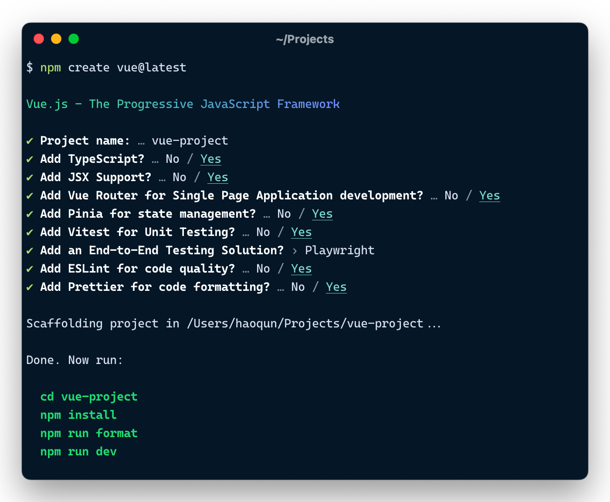

`create-vue` 源码阅读 [​](#create-vue-源码阅读)
=======================================

在 [vue-cli](https://cli.vuejs.org/zh) 处于维护状态后，Vue 团队又发布了一个的全新脚手架工具 [create-vue](https://github.com/vuejs/create-vue)，用来帮助开发者快速创建一个基于 [Vite](https://cn.vitejs.dev) 的 Vue 项目

[create-vue](https://github.com/vuejs/create-vue) The recommended way to start a Vite-powered Vue project

`create-vue` 使用方式 [​](#create-vue-使用方式)
---------------------------------------

```sh

    npm create vue@latest

```

`npm create` 本质上是 `npm init` 的一个别名，所以上面的命令等价于 `npm init vue@latest`

在运行 `npm init <name>` 时，会检查是否存在 `create-<name>` 的包，如果存在，则会使用该包来初始化项目

[`npm init` 初始化项目](../../workflow/node/npm#npm-init-初始化项目)

`create-vue` 项目结构 [​](#create-vue-项目结构)
---------------------------------------

```sh

    .
    ├── scripts                       # 脚本相关
    │   ├── build.mjs                   # 构建脚本
    │   ├── prepublish.mjs              # 发布脚本
    │   ├── snapshot.mjs                # 快照脚本
    │   └── test.mjs                    # 测试脚本
    ├── template                      # 模板文件
    ├── utils                         # 工具函数
    ├── index.ts                      # 入口文件
    ├── package.json
    └── tsconfig.json

```

### `scripts` 目录 [​](#scripts-目录)

> 均使用 `zx` 编写

*   `build.mjs` 使用 `esbuild` 打包 `create-vue` 项目（输出 `outfile.cjs` 文件）
*   `prepublish.mjs` 发布 `create-vue` 项目
    *   运行 `pnpm build`
    *   运行 `pnpm snapshot`
    *   提交代码到 `git`
*   `snapshot.mjs` 生成快照（按各种配置进行排列组合，然后调用 `create-vue` 生成各种类型的 `vue` 脚手架工程，并将工程保存在 `playground` 文件夹中）
*   `test.mjs` 进入 `playground` 文件夹，然后运行 `test:e2e` 和 `test:unit` 测试脚本

`create-vue` 项目依赖 [​](#create-vue-项目依赖)
---------------------------------------

> 介绍主要依赖包的作用

*   `zx`：命令行脚本执行
*   `npm-run-all`：并行执行 npm 脚本
*   `ejs`：模板引擎
*   `esbuild`：打包工具
*   `kolorist`：修改终端输出颜色
*   `minimist`：命令行参数解析
*   `prompts`：命令行交互

`create-vue` 源码笔记 [​](#create-vue-源码笔记)
---------------------------------------

> **当前 `create-vue` 源码版本为 v3.7.3**



`npm init vue@next` 初始化项目的主要步骤

1.  输入项目名称（默认值为 `vue-project`）
2.  询问配置，根据配置渲染对应模板
3.  完成创建输出项目运行提示

### `index.ts` 主流程 [​](#index-ts-主流程)

``` ts

    #!/usr/bin/env node
    
    import * as fs from 'node:fs'
    import * as path from 'node:path'
    
    import minimist from 'minimist'
    import prompts from 'prompts'
    import { red, green, bold } from 'kolorist'
    
    import ejs from 'ejs'
    
    import * as banners from './utils/banners'
    
    import renderTemplate from './utils/renderTemplate'
    import { postOrderDirectoryTraverse, preOrderDirectoryTraverse } from './utils/directoryTraverse'
    import generateReadme from './utils/generateReadme'
    import getCommand from './utils/getCommand'
    import renderEslint from './utils/renderEslint'
    import { FILES_TO_FILTER } from './utils/filterList'
    
    // 校验用户输入的 packageName 是否合法
    function isValidPackageName(projectName) {
      return /^(?:@[a-z0-9-*~][a-z0-9-*._~]*\/)?[a-z0-9-~][a-z0-9-._~]*$/.test(projectName)
    }
    
    // 将 projectName 转换为合法的 packageName
    function toValidPackageName(projectName) {
      return projectName
        .trim()
        .toLowerCase()
        .replace(/\s+/g, '-')
        .replace(/^[._]/, '')
        .replace(/[^a-z0-9-~]+/g, '-')
    }
    
    // 检查指定目录是否可以跳过清空（emptying）的操作
    function canSkipEmptying(dir: string) {
      if (!fs.existsSync(dir)) {
        return true
      }
    
      const files = fs.readdirSync(dir)
      if (files.length === 0) {
        return true
      }
      if (files.length === 1 && files[0] === '.git') {
        return true
      }
    
      return false
    }
    
    // 清空指定目录
    function emptyDir(dir) {
      if (!fs.existsSync(dir)) {
        return
      }
    
      postOrderDirectoryTraverse(
        dir,
        (dir) => fs.rmdirSync(dir),
        (file) => fs.unlinkSync(file)
      )
    }
    
    /* 主流程 */
    async function init() {
      // 输出 banner
      console.log()
      console.log(
        process.stdout.isTTY && process.stdout.getColorDepth() > 8
          ? banners.gradientBanner
          : banners.defaultBanner
      )
      console.log()
    
      const cwd = process.cwd()
      /* options 介绍 */
      // possible options:
      // --default
      // --typescript / --ts
      // --jsx
      // --router / --vue-router
      // --pinia
      // --with-tests / --tests (equals to `--vitest --cypress`)
      // --vitest
      // --cypress
      // --nightwatch
      // --playwright
      // --eslint
      // --eslint-with-prettier (only support prettier through eslint for simplicity)
      // --force (for force overwriting)
    
      // 解析命令行参数
      const argv = minimist(process.argv.slice(2), {
        alias: {
          typescript: ['ts'],
          'with-tests': ['tests'],
          router: ['vue-router']
        },
        string: ['_'],
        // all arguments are treated as booleans
        boolean: true
      })
    
      // 如果设置了 feature flags 则跳过 prompts 询问
      const isFeatureFlagsUsed =
        typeof (
          argv.default ??
          argv.ts ??
          argv.jsx ??
          argv.router ??
          argv.pinia ??
          argv.tests ??
          argv.vitest ??
          argv.cypress ??
          argv.nightwatch ??
          argv.playwright ??
          argv.eslint
        ) === 'boolean'
    
      let targetDir = argv._[0]
      // 默认为 vue-projects
      const defaultProjectName = !targetDir ? 'vue-project' : targetDir
      // 当同名文件夹存在时强制重写文件夹
      const forceOverwrite = argv.force
    
      let result: {
        projectName?: string
        shouldOverwrite?: boolean
        packageName?: string
        needsTypeScript?: boolean
        needsJsx?: boolean
        needsRouter?: boolean
        needsPinia?: boolean
        needsVitest?: boolean
        needsE2eTesting?: false | 'cypress' | 'nightwatch' | 'playwright'
        needsEslint?: boolean
        needsPrettier?: boolean
      } = {}
    
      try {
        // Prompts:
        // - Project name:
        //   - whether to overwrite the existing directory or not?
        //   - enter a valid package name for package.json
        // - Project language: JavaScript / TypeScript
        // - Add JSX Support?
        // - Install Vue Router for SPA development?
        // - Install Pinia for state management?
        // - Add Cypress for testing?
        // - Add Nightwatch for testing?
        // - Add Playwright for end-to-end testing?
        // - Add ESLint for code quality?
        // - Add Prettier for code formatting?
    
        // 执行交互式询问
        result = await prompts(
          [
            {
              name: 'projectName',
              type: targetDir ? null : 'text',
              message: 'Project name:',
              initial: defaultProjectName,
              onState: (state) => (targetDir = String(state.value).trim() || defaultProjectName)
            },
            {
              name: 'shouldOverwrite',
              type: () => (canSkipEmptying(targetDir) || forceOverwrite ? null : 'confirm'),
              message: () => {
                const dirForPrompt =
                  targetDir === '.' ? 'Current directory' : `Target directory "${targetDir}"`
    
                return `${dirForPrompt} is not empty. Remove existing files and continue?`
              }
            },
            {
              name: 'overwriteChecker',
              type: (prev, values) => {
                if (values.shouldOverwrite === false) {
                  throw new Error(red('✖') + ' Operation cancelled')
                }
                return null
              }
            },
            {
              name: 'packageName',
              type: () => (isValidPackageName(targetDir) ? null : 'text'),
              message: 'Package name:',
              initial: () => toValidPackageName(targetDir),
              validate: (dir) => isValidPackageName(dir) || 'Invalid package.json name'
            },
            {
              name: 'needsTypeScript',
              type: () => (isFeatureFlagsUsed ? null : 'toggle'),
              message: 'Add TypeScript?',
              initial: false,
              active: 'Yes',
              inactive: 'No'
            },
            {
              name: 'needsJsx',
              type: () => (isFeatureFlagsUsed ? null : 'toggle'),
              message: 'Add JSX Support?',
              initial: false,
              active: 'Yes',
              inactive: 'No'
            },
            {
              name: 'needsRouter',
              type: () => (isFeatureFlagsUsed ? null : 'toggle'),
              message: 'Add Vue Router for Single Page Application development?',
              initial: false,
              active: 'Yes',
              inactive: 'No'
            },
            {
              name: 'needsPinia',
              type: () => (isFeatureFlagsUsed ? null : 'toggle'),
              message: 'Add Pinia for state management?',
              initial: false,
              active: 'Yes',
              inactive: 'No'
            },
            {
              name: 'needsVitest',
              type: () => (isFeatureFlagsUsed ? null : 'toggle'),
              message: 'Add Vitest for Unit Testing?',
              initial: false,
              active: 'Yes',
              inactive: 'No'
            },
            {
              name: 'needsE2eTesting',
              type: () => (isFeatureFlagsUsed ? null : 'select'),
              message: 'Add an End-to-End Testing Solution?',
              initial: 0,
              choices: (prev, answers) => [
                { title: 'No', value: false },
                {
                  title: 'Cypress',
                  description: answers.needsVitest
                    ? undefined
                    : 'also supports unit testing with Cypress Component Testing',
                  value: 'cypress'
                },
                {
                  title: 'Nightwatch',
                  description: answers.needsVitest
                    ? undefined
                    : 'also supports unit testing with Nightwatch Component Testing',
                  value: 'nightwatch'
                },
                {
                  title: 'Playwright',
                  value: 'playwright'
                }
              ]
            },
            {
              name: 'needsEslint',
              type: () => (isFeatureFlagsUsed ? null : 'toggle'),
              message: 'Add ESLint for code quality?',
              initial: false,
              active: 'Yes',
              inactive: 'No'
            },
            {
              name: 'needsPrettier',
              type: (prev, values) => {
                if (isFeatureFlagsUsed || !values.needsEslint) {
                  return null
                }
                return 'toggle'
              },
              message: 'Add Prettier for code formatting?',
              initial: false,
              active: 'Yes',
              inactive: 'No'
            }
          ],
          {
            onCancel: () => {
              throw new Error(red('✖') + ' Operation cancelled')
            }
          }
        )
      } catch (cancelled) {
        console.log(cancelled.message)
        process.exit(1)
      }
    
      // `initial` won't take effect if the prompt type is null
      // so we still have to assign the default values here
      const {
        projectName,
        packageName = projectName ?? defaultProjectName,
        shouldOverwrite = argv.force,
        needsJsx = argv.jsx,
        needsTypeScript = argv.typescript,
        needsRouter = argv.router,
        needsPinia = argv.pinia,
        needsVitest = argv.vitest || argv.tests,
        needsEslint = argv.eslint || argv['eslint-with-prettier'],
        needsPrettier = argv['eslint-with-prettier']
      } = result
    
      const { needsE2eTesting } = result
      const needsCypress = argv.cypress || argv.tests || needsE2eTesting === 'cypress'
      const needsCypressCT = needsCypress && !needsVitest
      const needsNightwatch = argv.nightwatch || needsE2eTesting === 'nightwatch'
      const needsNightwatchCT = needsNightwatch && !needsVitest
      const needsPlaywright = argv.playwright || needsE2eTesting === 'playwright'
    
      const root = path.join(cwd, targetDir)
    
      if (fs.existsSync(root) && shouldOverwrite) {
        emptyDir(root)
      } else if (!fs.existsSync(root)) {
        fs.mkdirSync(root)
      }
      // 提示 project 目录
      console.log(`\nScaffolding project in ${root}...`)
    
      // 生成 package.json 文件
      const pkg = { name: packageName, version: '0.0.0' }
      fs.writeFileSync(path.resolve(root, 'package.json'), JSON.stringify(pkg, null, 2))
    
      // todo:
      // work around the esbuild issue that `import.meta.url` cannot be correctly transpiled
      // when bundling for node and the format is cjs
      // const templateRoot = new URL('./template', import.meta.url).pathname
      const templateRoot = path.resolve(__dirname, 'template') // 获取模板根目录
      const callbacks = []
      const render = function render(templateName) {
        const templateDir = path.resolve(templateRoot, templateName)
        renderTemplate(templateDir, root, callbacks)
      }
      // Render base template
      render('base')
    
      // 根据配置项添加配置
      if (needsJsx) {
        render('config/jsx')
      }
      if (needsRouter) {
        render('config/router')
      }
      if (needsPinia) {
        render('config/pinia')
      }
      if (needsVitest) {
        render('config/vitest')
      }
      if (needsCypress) {
        render('config/cypress')
      }
      if (needsCypressCT) {
        render('config/cypress-ct')
      }
      if (needsNightwatch) {
        render('config/nightwatch')
      }
      if (needsNightwatchCT) {
        render('config/nightwatch-ct')
      }
      if (needsPlaywright) {
        render('config/playwright')
      }
      if (needsTypeScript) {
        render('config/typescript')
    
        // Render tsconfigs
        render('tsconfig/base')
        if (needsCypress) {
          render('tsconfig/cypress')
        }
        if (needsCypressCT) {
          render('tsconfig/cypress-ct')
        }
        if (needsPlaywright) {
          render('tsconfig/playwright')
        }
        if (needsVitest) {
          render('tsconfig/vitest')
        }
        if (needsNightwatch) {
          render('tsconfig/nightwatch')
        }
        if (needsNightwatchCT) {
          render('tsconfig/nightwatch-ct')
        }
      }
    
      // Render ESLint config
      if (needsEslint) {
        renderEslint(root, { needsTypeScript, needsCypress, needsCypressCT, needsPrettier })
      }
    
      // Render code template.
      // prettier-ignore
      const codeTemplate =
        (needsTypeScript ? 'typescript-' : '') +
        (needsRouter ? 'router' : 'default')
      render(`code/${codeTemplate}`)
    
      // Render entry file (main.js/ts).
      if (needsPinia && needsRouter) {
        render('entry/router-and-pinia')
      } else if (needsPinia) {
        render('entry/pinia')
      } else if (needsRouter) {
        render('entry/router')
      } else {
        render('entry/default')
      }
    
      // An external data store for callbacks to share data
      const dataStore = {}
      // Process callbacks
      for (const cb of callbacks) {
        await cb(dataStore)
      }
    
      // 渲染 ejs 模板
      preOrderDirectoryTraverse(
        root,
        () => {},
        (filepath) => {
          if (filepath.endsWith('.ejs')) {
            const template = fs.readFileSync(filepath, 'utf-8')
            const dest = filepath.replace(/\.ejs$/, '')
            const content = ejs.render(template, dataStore[dest])
    
            fs.writeFileSync(dest, content)
            fs.unlinkSync(filepath)
          }
        }
      )
    
      // Cleanup.
    
      // We try to share as many files between TypeScript and JavaScript as possible.
      // If that's not possible, we put `.ts` version alongside the `.js` one in the templates.
      // So after all the templates are rendered, we need to clean up the redundant files.
      // (Currently it's only `cypress/plugin/index.ts`, but we might add more in the future.)
      // (Or, we might completely get rid of the plugins folder as Cypress 10 supports `cypress.config.ts`)
    
      // 当配置了 TypeScript 时，将 js 文件转换为 ts 文件
      if (needsTypeScript) {
        // Convert the JavaScript template to the TypeScript
        // Check all the remaining `.js` files:
        //   - If the corresponding TypeScript version already exists, remove the `.js` version.
        //   - Otherwise, rename the `.js` file to `.ts`
        // Remove `jsconfig.json`, because we already have tsconfig.json
        // `jsconfig.json` is not reused, because we use solution-style `tsconfig`s, which are much more complicated.
        preOrderDirectoryTraverse(
          root,
          () => {},
          (filepath) => {
            if (filepath.endsWith('.js') && !FILES_TO_FILTER.includes(path.basename(filepath))) {
              const tsFilePath = filepath.replace(/\.js$/, '.ts')
              if (fs.existsSync(tsFilePath)) {
                fs.unlinkSync(filepath)
              } else {
                fs.renameSync(filepath, tsFilePath)
              }
            } else if (path.basename(filepath) === 'jsconfig.json') {
              fs.unlinkSync(filepath)
            }
          }
        )
    
        const indexHtmlPath = path.resolve(root, 'index.html')
        const indexHtmlContent = fs.readFileSync(indexHtmlPath, 'utf8')
        fs.writeFileSync(indexHtmlPath, indexHtmlContent.replace('src/main.js', 'src/main.ts'))
      } else {
        // Remove all the remaining `.ts` files
        preOrderDirectoryTraverse(
          root,
          () => {},
          (filepath) => {
            if (filepath.endsWith('.ts')) {
              fs.unlinkSync(filepath)
            }
          }
        )
      }
    
      // 获取当前终端正在使用的包管理工具
      const userAgent = process.env.npm_config_user_agent ?? ''
      const packageManager = /pnpm/.test(userAgent) ? 'pnpm' : /yarn/.test(userAgent) ? 'yarn' : 'npm'
    
      // 生成 README.md
      fs.writeFileSync(
        path.resolve(root, 'README.md'),
        generateReadme({
          projectName: result.projectName ?? result.packageName ?? defaultProjectName,
          packageManager,
          needsTypeScript,
          needsVitest,
          needsCypress,
          needsNightwatch,
          needsPlaywright,
          needsNightwatchCT,
          needsCypressCT,
          needsEslint
        })
      )
    
      console.log(`\nDone. Now run:\n`)
      // 输出项目命令提示
      if (root !== cwd) {
        const cdProjectName = path.relative(cwd, root)
        console.log(
          `  ${bold(green(`cd ${cdProjectName.includes(' ') ? `"${cdProjectName}"` : cdProjectName}`))}`
        )
      }
      console.log(`  ${bold(green(getCommand(packageManager, 'install')))}`)
      if (needsPrettier) {
        console.log(`  ${bold(green(getCommand(packageManager, 'format')))}`)
      }
      console.log(`  ${bold(green(getCommand(packageManager, 'dev')))}`)
      console.log()
    }
    
    init().catch((e) => {
      console.error(e)
    })

``` 

### 工具函数 [​](#工具函数)

在 `create-vue` 项目中，有一些工具函数，这些函数都放在 `utils` 目录下

#### `banners.ts` [​](#banners-ts)

生成渐变色的 `banner`

```ts

    const defaultBanner = 'Vue.js - The Progressive JavaScript Framework'
    
    // generated by the following code:
    //
    // require('gradient-string')([
    //   { color: '#42d392', pos: 0 },
    //   { color: '#42d392', pos: 0.1 },
    //   { color: '#647eff', pos: 1 }
    // ])('Vue.js - The Progressive JavaScript Framework'))
    //
    // Use the output directly here to keep the bundle small.
    const gradientBanner =
      '\x1B[38;2;66;211;146mV\x1B[39m\x1B[38;2;66;211;146mu\x1B[39m\x1B[38;2;66;211;146me\x1B[39m\x1B[38;2;66;211;146m.\x1B[39m\x1B[38;2;66;211;146mj\x1B[39m\x1B[38;2;67;209;149ms\x1B[39m \x1B[38;2;68;206;152m-\x1B[39m \x1B[38;2;69;204;155mT\x1B[39m\x1B[38;2;70;201;158mh\x1B[39m\x1B[38;2;71;199;162me\x1B[39m \x1B[38;2;72;196;165mP\x1B[39m\x1B[38;2;73;194;168mr\x1B[39m\x1B[38;2;74;192;171mo\x1B[39m\x1B[38;2;75;189;174mg\x1B[39m\x1B[38;2;76;187;177mr\x1B[39m\x1B[38;2;77;184;180me\x1B[39m\x1B[38;2;78;182;183ms\x1B[39m\x1B[38;2;79;179;186ms\x1B[39m\x1B[38;2;80;177;190mi\x1B[39m\x1B[38;2;81;175;193mv\x1B[39m\x1B[38;2;82;172;196me\x1B[39m \x1B[38;2;83;170;199mJ\x1B[39m\x1B[38;2;83;167;202ma\x1B[39m\x1B[38;2;84;165;205mv\x1B[39m\x1B[38;2;85;162;208ma\x1B[39m\x1B[38;2;86;160;211mS\x1B[39m\x1B[38;2;87;158;215mc\x1B[39m\x1B[38;2;88;155;218mr\x1B[39m\x1B[38;2;89;153;221mi\x1B[39m\x1B[38;2;90;150;224mp\x1B[39m\x1B[38;2;91;148;227mt\x1B[39m \x1B[38;2;92;145;230mF\x1B[39m\x1B[38;2;93;143;233mr\x1B[39m\x1B[38;2;94;141;236ma\x1B[39m\x1B[38;2;95;138;239mm\x1B[39m\x1B[38;2;96;136;243me\x1B[39m\x1B[38;2;97;133;246mw\x1B[39m\x1B[38;2;98;131;249mo\x1B[39m\x1B[38;2;99;128;252mr\x1B[39m\x1B[38;2;100;126;255mk\x1B[39m'
    
    export { defaultBanner, gradientBanner }

```

#### `deepMerge` [​](#deepmerge)

在源码中使用 `deepMerge` 对 `package.json` 中的字段进行合并

```ts

    const isObject = (val) => val && typeof val === 'object'
    const mergeArrayWithDedupe = (a, b) => Array.from(new Set([...a, ...b]))
    
    /**
     * Recursively merge the content of the new object to the existing one
     * @param {Object} target the existing object
     * @param {Object} obj the new object
     */
    function deepMerge(target, obj) {
      for (const key of Object.keys(obj)) {
        const oldVal = target[key]
        const newVal = obj[key]
    
        if (Array.isArray(oldVal) && Array.isArray(newVal)) {
          target[key] = mergeArrayWithDedupe(oldVal, newVal)
        } else if (isObject(oldVal) && isObject(newVal)) {
          target[key] = deepMerge(oldVal, newVal)
        } else {
          target[key] = newVal
        }
      }
    
      return target
    }
    
    export default deepMerge

```

#### `directoryTraverse` [​](#directorytraverse)

遍历目录下的所有文件和子目录，并在遍历的过程中调用提供的回调函数 dirCallback 和 fileCallback 处理目录和文件

```ts

    import * as fs from 'node:fs'
    import * as path from 'node:path'
    
    // 先处理当前目录
    export function preOrderDirectoryTraverse(dir, dirCallback, fileCallback) {
      for (const filename of fs.readdirSync(dir)) {
        if (filename === '.git') {
          continue
        }
        const fullpath = path.resolve(dir, filename)
        if (fs.lstatSync(fullpath).isDirectory()) {
          dirCallback(fullpath)
          // in case the dirCallback removes the directory entirely
          if (fs.existsSync(fullpath)) {
            preOrderDirectoryTraverse(fullpath, dirCallback, fileCallback)
          }
          continue
        }
        fileCallback(fullpath)
      }
    }
    
    // 先处理子目录
    export function postOrderDirectoryTraverse(dir, dirCallback, fileCallback) {
      for (const filename of fs.readdirSync(dir)) {
        if (filename === '.git') {
          continue
        }
        const fullpath = path.resolve(dir, filename)
        if (fs.lstatSync(fullpath).isDirectory()) {
          postOrderDirectoryTraverse(fullpath, dirCallback, fileCallback)
          dirCallback(fullpath)
          continue
        }
        fileCallback(fullpath)
      }
    }

```

#### `renderTemplate` [​](#rendertemplate)

渲染模板（将模板文件夹/文件复制到目标文件夹）

```ts

    import * as fs from 'node:fs'
    import * as path from 'node:path'
    import { pathToFileURL } from 'node:url'
    
    import deepMerge from './deepMerge'
    import sortDependencies from './sortDependencies'
    
    /**
     * Renders a template folder/file to the file system,
     * by recursively copying all files under the `src` directory,
     * with the following exception:
     *   - `_filename` should be renamed to `.filename`
     *   - Fields in `package.json` should be recursively merged
     * @param {string} src source filename to copy
     * @param {string} dest destination filename of the copy operation
     */
    function renderTemplate(
      src, // 模板路径
      dest, // 项目路径
      callbacks,
    ) {
      const stats = fs.statSync(src)
    
      if (stats.isDirectory()) {
        // 跳过 node_modules 目录
        if (path.basename(src) === 'node_modules') {
          return
        }
    
        // 对目录进行递归处理
        fs.mkdirSync(dest, { recursive: true })
        for (const file of fs.readdirSync(src)) {
          renderTemplate(path.resolve(src, file), path.resolve(dest, file), callbacks)
        }
        return
      }
    
      const filename = path.basename(src)
    
      // 处理 package.json
      if (filename === 'package.json' && fs.existsSync(dest)) {
        // merge instead of overwriting
        const existing = JSON.parse(fs.readFileSync(dest, 'utf8'))
        const newPackage = JSON.parse(fs.readFileSync(src, 'utf8'))
        const pkg = sortDependencies(deepMerge(existing, newPackage))
        fs.writeFileSync(dest, JSON.stringify(pkg, null, 2) + '\n')
        return
      }
    
      // 处理 extensions.json
      if (filename === 'extensions.json' && fs.existsSync(dest)) {
        // merge instead of overwriting
        const existing = JSON.parse(fs.readFileSync(dest, 'utf8'))
        const newExtensions = JSON.parse(fs.readFileSync(src, 'utf8'))
        const extensions = deepMerge(existing, newExtensions)
        fs.writeFileSync(dest, JSON.stringify(extensions, null, 2) + '\n')
        return
      }
    
      // 将 _filename 重命名为 .filename
      if (filename.startsWith('_')) {
        // rename `_file` to `.file`
        dest = path.resolve(path.dirname(dest), filename.replace(/^_/, '.'))
      }
    
      // 处理 .gitignore
      if (filename === '_gitignore' && fs.existsSync(dest)) {
        // append to existing .gitignore
        const existing = fs.readFileSync(dest, 'utf8')
        const newGitignore = fs.readFileSync(src, 'utf8')
        fs.writeFileSync(dest, existing + '\n' + newGitignore)
        return
      }
    
      // data file for EJS templates
      if (filename.endsWith('.data.mjs')) {
        // use dest path as key for the data store
        dest = dest.replace(/\.data\.mjs$/, '')
    
        // Add a callback to the array for late usage when template files are being processed
        callbacks.push(async (dataStore) => {
          const getData = (await import(pathToFileURL(src).toString())).default
    
          // Though current `getData` are all sync, we still retain the possibility of async
          dataStore[dest] = await getData({
            oldData: dataStore[dest] || {},
          })
        })
    
        return // skip copying the data file
      }
    
      // 复制文件
      fs.copyFileSync(src, dest)
    }
    
    export default renderTemplate

```

#### `sortDependencies` [​](#sortdependencies)

对 `package.json` 中的依赖进行排序

```ts

    export default function sortDependencies(packageJson) {
      const sorted = {}
    
      const depTypes = ['dependencies', 'devDependencies', 'peerDependencies', 'optionalDependencies']
    
      for (const depType of depTypes) {
        if (packageJson[depType]) {
          sorted[depType] = {}
    
          Object.keys(packageJson[depType])
            .sort()
            .forEach((name) => {
              sorted[depType][name] = packageJson[depType][name]
            })
        }
      }
    
      return {
        ...packageJson,
        ...sorted,
      }
    }

``` 
