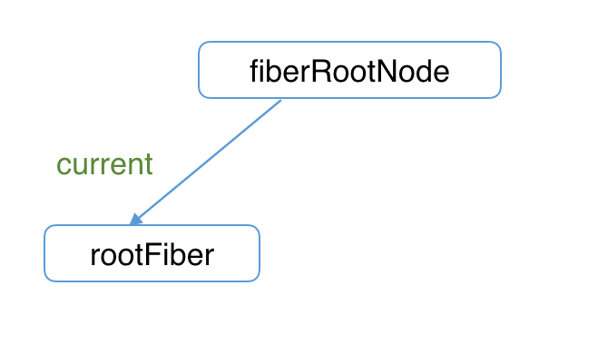

Fiber 架构和双缓存 [​](#fiber-架构和双缓存)
===============================

React 16 开始引入了 Fiber 架构，它的主要目的是为了解决 React 15 存在的一些问题，比如递归调用栈过深导致的卡顿、无法中断渲染、无法优先级更新等。即**将递归的无法中断的更新重构为异步的可中断更新**

Fiber 的含义 [​](#fiber-的含义)
-------------------------

Fiber 的三层含义：

*   **作为架构**来说：
    *   React 15 的 `Reconciler` 采用递归的方式执行，数据保存在递归调用栈中，所以被称为 `stack Reconciler`
    *   React 16 的 `Reconciler` 基于 `Fiber 节点` 实现，被称为 `Fiber Reconciler`
*   **作为静态的数据结构**来说：每个 `Fiber 节点` 对应一个 `React element` ，保存了该组件的类型（函数组件/类组件/原生组件...）、对应的 DOM 节点等信息
*   **作为动态的工作单元**来说：每个 `Fiber 节点` 保存了本次更新中该组件改变的状态、要执行的工作（需要被删除/被插入页面中/被更新...）

Fiber Reconciler 的主要作用

*   能够把可中断的任务切片处理
*   能够调整优先级，重置并复用任务
*   能够在父元素与子元素之间交错处理，以支持 React 中的布局
*   能够在 `render()` 中返回多个元素
*   更好地支持错误边界

[Fiber reconciler | React 旧版官方文档](https://zh-hans.legacy.reactjs.org/docs/codebase-overview.html#fiber-reconciler)

Fiber 的数据结构 [​](#fiber-的数据结构)
-----------------------------

Fiber 上主要有 DOM、Fiber 树、状态数据、副作用四种标识

> 源码地址 [function FiberNode | ReactFiber.old.js](https://github.com/wild2life/code-analysis/blob/f0dc66687fe470217252ef38ae4f0697dc2fc15d/react-v18.2.0/src/react/packages/react-reconciler/src/ReactFiber.old.js#L118)

```ts

    function FiberNode(
      tag: WorkTag, // /react-reconciler/src/ReactWorkTags.js
      pendingProps: mixed,
      key: null | string,
      mode: TypeOfMode,
    ) {
      /*! --------------- 作为静态数据结构 --------------- */
      this.tag = tag // Fiber 对应组件的类型
      this.key = key // key
      this.elementType = null // 大部分情况同 type，某些情况不同，比如 FunctionComponent 使用 React.memo 包裹
      this.type = null // FunctionComponent 指函数本身；ClassComponent 指 class；HostComponent 指 DOM 节点的tagName
      this.stateNode = null // Fiber 对应的真实DOM节点
    
      /*! --------------- 作为 Fiber 架构 --------------- */
      this.return = null // 指向父级 Fiber 节点
      this.child = null // 指向第一个子 Fiber 节点
      this.sibling = null // 指向下一个兄弟 Fiber 节点
      this.index = 0
    
      this.ref = null
    
      /*! -------------- 作为动态的工作单元 --------------- */
      // 保存本次更新造成的状态改变相关信息
      this.pendingProps = pendingProps
      this.memoizedProps = null
      this.updateQueue = null
      this.memoizedState = null
      this.dependencies = null
    
      this.mode = mode
    
      // Effects 副作用相关
      this.flags = NoFlags
      this.subtreeFlags = NoFlags
      this.deletions = null
    
      // 调度优先级相关
      this.lanes = NoLanes
      this.childLanes = NoLanes
    
      // 指向该 Fiber 节点对应的双缓存 Fiber 节点
      this.alternate = null
    }

```

Fiber 双缓存 [​](#fiber-双缓存)
-------------------------

::: tip 双缓存

当我们用 `canvas` 绘制动画时，每一帧绘制前都会调用 `ctx.clearRect` 清除上一帧的画面，如果当前帧画面计算量比较大，导致清除上一帧画面到绘制当前帧画面之间有较长间隙，就会出现白屏。

为了解决这个问题，我们可以在内存中绘制当前帧动画，绘制完毕后直接用当前帧替换上一帧画面，由于省去了两帧替换间的计算时间，不会出现从白屏到出现画面的闪烁情况。

这种在**内存中构建并直接替换**的技术叫做双缓存

::: 
React 使用“双缓存”来完成 Fiber 树的构建与替换——对应着 DOM 树的创建与更新

### Fiber 双缓存的构建 [​](#fiber-双缓存的构建)

在 React 中最多会同时存在两棵 Fiber 树

*   当前屏幕上显示内容对应的 Fiber 树叫做 `current Fiber 树`
*   正在内存中构建的 Fiber 树叫做 `workInProgress Fiber 树`

React 应用的根节点通过使 `current` 指针在不同 `Fiber 树` 的 `rootFiber` 间切换来完成 `current Fiber 树` 指向的切换

当 `workInProgress Fiber 树` 构建完成交给 `Renderer` 渲染在页面上后，React 会将应用根节点的 `current` 指针指向 `workInProgress Fiber 树`，此时 `workInProgress Fiber 树` 就变为 `current Fiber 树`

每次状态更新都会产生新的 `workInProgress Fiber 树`，通过 `current` 与 `workInProgress` 的替换，完成 DOM 更新

::: tip 

*   `current Fiber 树` 中的 `Fiber 节点` 被称为 `current fiber`
*   `workInProgress Fiber 树` 中的 `Fiber 节点` 被称为 `workInProgress fiber`
*   `current Fiber 树` 中的 `Fiber 节点` 都有 `alternate` 属性指向 `workInProgress Fiber 树` 中对应的 `Fiber 节点`

```js

    currentFiber.alternate === workInProgressFiber
    workInProgressFiber.alternate === currentFiber

``` 
::: 
### `mount` 阶段 [​](#mount-阶段)

> 以下面的代码为 🌰

```js

    function App() {
      const [num, add] = useState(0)
      return <p onClick={() => add(num + 1)}>{num}</p>
    }
    
    ReactDOM.render(<App />, document.getElementById('root'))

```

1.  首次执行 `ReactDOM.render` 时会创建 `fiberRootNode`（源码中叫 `fiberRoot`）和 `rootFiber`

*   `fiberRootNode` 是整个应用的根节点
*   `rootFiber` 是 `<App/>` 所在组件树的根节点

::: tip 为什么要区分 `fiberRootNode` 与 `rootFiber`

因为在一个 React 应用中我们可以多次调用 `ReactDOM.render` 来渲染不同的组件树，这时它们会拥有不同的 `rootFiber`。但是整个应用的根节点只有一个那就是 `fiberRootNode`

::: 
这时 `fiberRootNode` 的 `current` 指针会指向当前页面上已渲染内容对应 `Fiber 树`（即 `current Fiber 树`）



```js

    fiberRootNode.current = rootFiber

```

1. 由于是首屏渲染，页面中还没有挂载任何 DOM，所以 `fiberRootNode.current` 指向的 `rootFiber` 是没有任何 `子 Fiber 节点`的（即`current Fiber 树`为空）

2.  接下来进入 `render 阶段`，根据组件返回的 JSX 在内存中依次创建 `Fiber 节点` 并连接在一起构建 `Fiber 树`，其被称为`workInProgress Fiber 树`（下图中右侧为内存中构建的树，左侧为页面显示的树）

在构建 `workInProgress Fiber 树` 时会尝试复用 `current Fiber 树` 中已有的 `Fiber 节点` 内的属性，在`首屏渲染`时只有 `rootFiber` 存在对应的 `current fiber`（即 `rootFiber.alternate`）


3.  图中右侧已构建完的 `workInProgress Fiber 树` 会在 `commit 阶段` 渲染到页面

此时 DOM 更新为右侧树对应的界面。`fiberRootNode` 的 `current` 指针指向 `workInProgress Fiber 树` 使其变更为`current Fiber 树`（即下图所示）


### `update` 阶段 [​](#update-阶段)

1.  当我们点击 `p 节点` 触发状态改变时，会开启一次新的 `render 阶段` 并构建一棵新的 `workInProgress Fiber 树`


和 `mount` 时一样，`workInProgress fiber` 的创建会复用 `current Fiber 树` 中对应的节点数据

> 决定是否复用的过程就是 Diff 算法

2.  `workInProgress Fiber 树` 在 `render 阶段` 完成构建后进入 `commit 阶段` 渲染到页面上。在渲染完毕后`workInProgress Fiber 树` 变更为 `current Fiber 树`


* * *

相关资料

*   [Fiber 架构的实现原理 | React 技术揭秘](https://react.iamkasong.com/process/fiber.html)
*   [Fiber 架构的工作原理 | React 技术揭秘](https://react.iamkasong.com/process/doubleBuffer.html)
