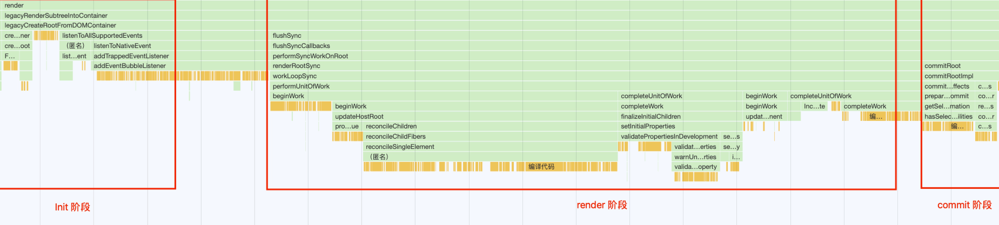
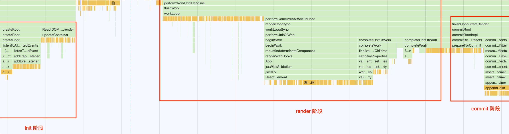

启动模式和渲染流程 [​](#启动模式和渲染流程)
=========================

启动模式 [​](#启动模式)
---------------

在 React 18 中，React 应用有两种启动模式：

*   **`legacy` 模式**：`ReactDOM.render(<App />, document.getElementById('root'))` 这个模式可能不支持[这些新功能(concurrent 支持的所有功能)](https://17.reactjs.org/docs/concurrent-mode-patterns.html#the-three-steps)
*   **`concurrent` 模式**：`ReactDOM.createRoot(rootNode).render(<App />)` 这个模式开启了所有的新功能（是 React 18 的默认模式）

::: tip 
`blocking` 模式

在 React 17 中，还有一种 **`blocking` 模式**，它是开启部分 `concurrent` 模式特性的中间模式，是作为迁移到 **`concurrent` 模式**的第一个步骤

```js

    ReactDOM.createBlockingRoot(rootNode).render(<App />)

```
::: 
> 这个模式 React 18 中已经被移除

[Blocking Mode](https://17.reactjs.org/docs/concurrent-mode-adoption.html#migration-step-blocking-mode)

### 各种模式对特性的支持 [​](#各种模式对特性的支持)

|   |  legacy 模式   | blocking 模式   | concurrent 模式 |
|---------|---------|---------|---------|
| [String Refs](https://zh-hans.reactjs.org/docs/refs-and-the-dom.html#legacy-api-string-refs)  | ✅   | 🚫\*\*  | 🚫\*\*   
| [Legacy Context](https://zh-hans.reactjs.org/docs/legacy-context.html) | ✅  | 🚫\*\*  | 🚫\*\*
| [findDOMNode](https://zh-hans.reactjs.org/docs/strict-mode.html#warning-about-deprecated-finddomnode-usage) | ✅  | 🚫\*\*   | 🚫\*\*
| [Suspense](https://zh-hans.reactjs.org/docs/concurrent-mode-suspense.html#what-is-suspense-exactly) | ✅  | ✅  | ✅
| [SuspenseList](https://zh-hans.reactjs.org/docs/concurrent-mode-patterns.html#suspenselist) | 🚫  | ✅  | ✅
| Suspense SSR + Hydration | 🚫  | ✅  | ✅
| Progressive Hydration | 🚫  | ✅  | ✅
| Selective Hydration | 🚫  | 🚫  | ✅
| Cooperative Multitasking | 🚫  | 🚫  | ✅
| Automatic batching of multiple setStates |  🚫\*  | ✅  | ✅
| [Priority-based Rendering](https://zh-hans.reactjs.org/docs/concurrent-mode-patterns.html#splitting-high-and-low-priority-state) |  🚫 |  🚫 |  ✅
| [Interruptible Prerendering](https://zh-hans.reactjs.org/docs/concurrent-mode-intro.html#interruptible-rendering) |  🚫 |  🚫 | ✅
| [useTransition](https://zh-hans.reactjs.org/docs/concurrent-mode-patterns.html#transitions) |  🚫  |  🚫  | ✅
| [useDeferredValue](https://zh-hans.reactjs.org/docs/concurrent-mode-patterns.html#deferring-a-value) |  🚫 |  🚫 |  ✅
| [Suspense Reveal "Train"](https://zh-hans.reactjs.org/docs/concurrent-mode-patterns.html#suspense-reveal-train) |  🚫  |  🚫  | ✅

\*`：legacy` 模式在合成事件中有自动批处理的功能，但仅限于一个浏览器任务。非 React 事件想使用这个功能必须使用 `unstable_batchedUpdates`。在 `blocking` 模式和 `concurrent` 模式下，所有的 `setState` 在默认情况下都是批处理的

\*\*：会在开发中发出警告

* * *

::: tip 

*   React 通过不同的**入口函数**开启不同模式，且模式的变化影响的是整个应用的工作方式，所以无法只针对某个组件开启不同模式
*   这几种模式下的 `fiber.mode` 的值有所不同

```ts

    export type RootTag = 0 | 1
    
    export const LegacyRoot = 0
    export const ConcurrentRoot = 1

```
::: 
渲染流程 [​](#渲染流程)
---------------

React 应用程序的渲染流程可以分为三个阶段：

*   初始化阶段
*   `render` 阶段：即 Reconciler 工作的阶段，`render` 阶段会调用组件的 `render` 方法获取组件的 `React Element`，并构建 `Fiber` 树
*   `commit` 阶段：即 Renderer 工作的阶段，`commit` 阶段会把 `render` 阶段提交的信息渲染在页面上

`render` 与 `commit` 阶段统称为 `work`，即 React 在工作中。如果任务正在 Scheduler 内调度就不属于 `work` 阶段

### legacy 模式的调用栈 [​](#legacy-模式的调用栈)



### concurrent 模式的调用栈 [​](#concurrent-模式的调用栈)

