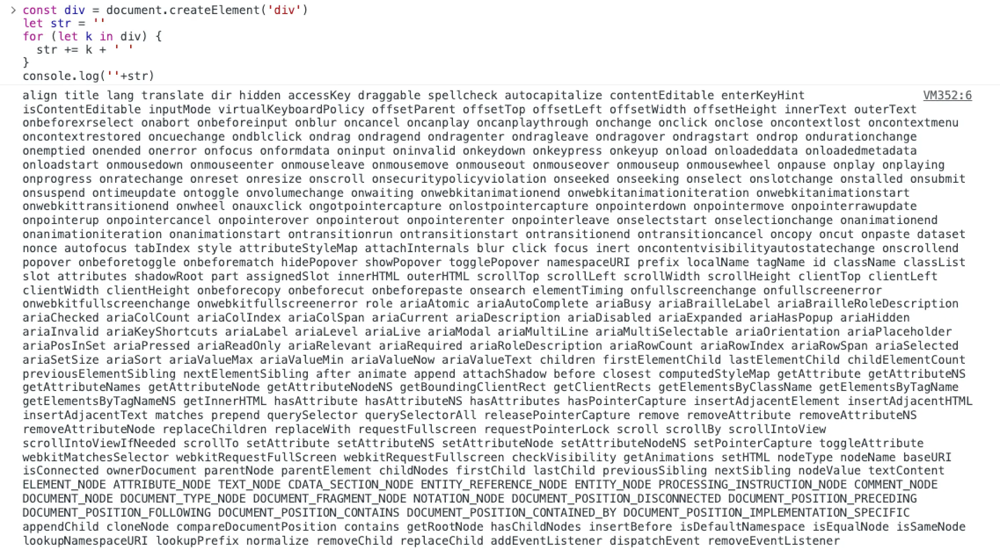

Virtual DOM [​](#virtual-dom)
=============================

Virtual DOM（虚拟 DOM）是一种用于优化 Web 前端性能的技术，也是 React 的关键特性之一

为什么需要 Virtual DOM [​](#为什么需要-virtual-dom)
-----------------------------------------

浏览器中的 DOM 是非常“昂贵"的，它是一个很复杂的数据结构，我们可以通过下面的代码来查看 DOM 对象上的属性和方法

> 创建一个 `div` 元素为 🌰

```js

    const div = document.createElement('div')
    let str = ''
    for (let k in div) {
      str += k + ' '
    }
    console.log('' + str)

```



可以看到原生 DOM 对象上有很多属性和方法，而我们在操作 DOM 后，浏览器会进行重排（Reflow）和重绘（Repaint），一旦操作不当，就会造成性能问题

什么是 Virtual DOM [​](#什么是-virtual-dom)
-------------------------------------

Virtual DOM 是 JavaScript 和 DOM 之间的一个映射缓存，其本质上是**一个轻量级的 JavaScript 对象树**，它通过这个树来描述 DOM 树的结构和属性

Virtual DOM 的工作原理 [​](#virtual-dom-的工作原理)
-----------------------------------------

1.  **创建 Virtual DOM**：当应用初始化时或数据发生变化时，会创建或更新 Virtual DOM
2.  **Diff 算法**：在生成新的 Virtual DOM 之后，会与之前的 Virtual DOM 进行比较，找出两者之间的差异。这个过程称为 **Diff 算法**，它能够高效地计算出需要更新的最小操作集合
3.  **更新原生 DOM**：通过 Diff 算法的结果，确定了哪些部分需要更新，然后将这些变化应用到真实 DOM 上。这个阶段真正将变化应用到 DOM 上，通常使用最小的 DOM 操作来实现更新，从而减少了 DOM 操作的开销。

可以看到 Virtual DOM 的本质是一种在内存中进行 DOM 树的处理和优化的机制。通过在 JavaScript 对象上进行操作，可以避免频繁的直接 DOM 操作，从而提高了应用的性能和响应速度。虽然 Virtual DOM 本身会引入一定的计算开销，但由于减少了真实 DOM 操作，整体上还是对性能有所提升

Virtual DOM 的优缺点 [​](#virtual-dom-的优缺点)
---------------------------------------

**优点**：

*   简化开发：Virtual DOM 使得开发者能够更专注于应用的业务逻辑，而无需过多关注手动 DOM 操作
*   性能方面：使用 Virtual DOM，能够有效避免真实 DOM 数频繁更新，减少多次引起重绘与回流，提高性能
*   跨平台：借助 Virtual DOM，带来了跨平台的能力，可以一套代码多端运行

**缺点**：

*   在一些性能要求极高的应用中 Virtual DOM 无法进行针对性的极致优化
*   首次渲染慢（需要构建 Virtual DOM）

* * *

相关资料

[网上都说操作真实 DOM 慢，但测试结果却比 React 更快，为什么？ - 尤雨溪的回答](https://www.zhihu.com/question/31809713/answer/53544875)