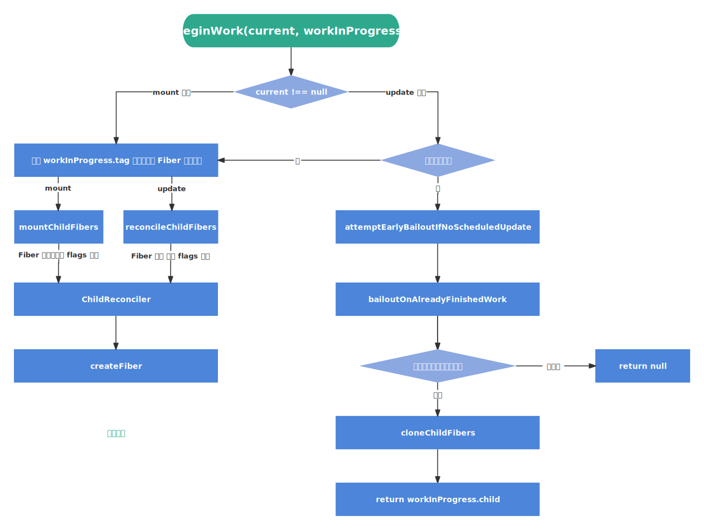

`beginWork` “递”阶段 [​](#beginwork-递-阶段)
======================================

`beginWork` 主要工作是根据传入的 `Fiber 节点` 创建或复用 `子 Fiber 节点`

> `beginWork` 流程图



`beginWork` 的入参 [​](#beginwork-的入参)
-----------------------------------

> 源码地址 [beginWork | react-reconciler/src/ReactFiberBeginWork.old.js](https://github.com/wild2life/code-analysis/blob/f0dc66687fe470217252ef38ae4f0697dc2fc15d/react-v18.2.0/src/react/packages/react-reconciler/src/ReactFiberBeginWork.old.js#L3685)

```ts

    function beginWork(
      current: Fiber | null,
      workInProgress: Fiber,
    
      // 优先级相关（先不管这个参数）
      renderLanes: Lanes,
    ): Fiber | null {
      // ... 省略函数体
    }

```

在之前解读 [`performUnitOfWork`](./schedule-update-on-fiber#performunitofwork) 时说过 `current` 和 `workInProgress` 这两个重要变量，这里再重复一下：

*   `current` 表示当前页面正在使用的 `Fiber 节点`，即 `workInProgress.alternate`
*   `workInProgress` 表示当前正在构建的 `Fiber 节点`

`beginWork` 工作的两部分 [​](#beginwork-工作的两部分)
-----------------------------------------

在 [Fiber 双缓存的构建](../base/fiber#fiber-双缓存的构建) 时说过，除 `rootFiber` 以外组件 `mount` 时 `current === null`，而组件 `update` 时，由于已经 `mount` 过了，所以 `current !== null`（即 `current === null ? mount : update`）

根据这个特性可以将 `beginWork` 的工作分为两部分：

*   **`update` 时**：如果 `current` 存在且满足一定的条件时，可以复用 `current` 的 `Fiber 节点`（即上一次更新的 `Fiber 节点`）
*   **`mount` 时**：根据 `fiber.tag` 进入不同的处理函数，然后调用 `reconcileChildren` 创建 `子 Fiber 节点`

```ts

    function beginWork(current: Fiber | null, workInProgress: Fiber, renderLanes: Lanes): Fiber | null {
      /* update 时，如果 current 存在可能存在优化路径，可以复用上一次更新的 Fiber 节点 */
      if (current !== null) {
        const oldProps = current.memoizedProps
        const newProps = workInProgress.pendingProps
    
        if (
          oldProps !== newProps ||
          hasLegacyContextChanged() ||
          // Force a re-render if the implementation changed due to hot reload:
          (__DEV__ ? workInProgress.type !== current.type : false)
        ) {
          // If props or context changed, mark the fiber as having performed work.
          // This may be unset if the props are determined to be equal later (memo).
          // 当 props 或 context 发生变化时将 Fiber 标记为需要更新
          didReceiveUpdate = true
        } else {
          // checkScheduledUpdateOrContext 函数用于检查是否有挂起的更新或 context 变化
          const hasScheduledUpdateOrContext = checkScheduledUpdateOrContext(current, renderLanes)
          if (
            !hasScheduledUpdateOrContext &&
            // If this is the second pass of an error or suspense boundary, there
            // may not be work scheduled on `current`, so we check for this flag.
            (workInProgress.flags & DidCapture) === NoFlags
          ) {
            // 当没有挂起的更新或 context 时，复用 current 的节点
            didReceiveUpdate = false
            return attemptEarlyBailoutIfNoScheduledUpdate(current, workInProgress, renderLanes)
          }
          if ((current.flags & ForceUpdateForLegacySuspense) !== NoFlags) {
            // This is a special case that only exists for legacy mode.
            // See https://github.com/facebook/react/pull/19216.
            // legacy 模式强制更新
            didReceiveUpdate = true
          } else {
            // An update was scheduled on this fiber, but there are no new props
            // nor legacy context. Set this to false. If an update queue or context
            // consumer produces a changed value, it will set this to true. Otherwise,
            // the component will assume the children have not changed and bail out.
            // 在这个 Fiber 节点上安排了一个更新，但由于 props 和 context 都没有发生变化，将其设置为 false
            // 如果更新队列或 context 消费者生成了更改的值，则将其设置为 true。否则该组件会设置 children 没有更新并退出
            didReceiveUpdate = false
          }
        }
      } else {
        /* mount 时，根据 tag 创建不同类型的子 Fiber 节点 */
        didReceiveUpdate = false
    
        if (getIsHydrating() && isForkedChild(workInProgress)) {
          // Check if this child belongs to a list of muliple children in
          // its parent.
          //
          // In a true multi-threaded implementation, we would render children on
          // parallel threads. This would represent the beginning of a new render
          // thread for this subtree.
          //
          // We only use this for id generation during hydration, which is why the
          // logic is located in this special branch.
          const slotIndex = workInProgress.index
          const numberOfForks = getForksAtLevel(workInProgress)
          pushTreeId(workInProgress, numberOfForks, slotIndex)
        }
      }
    
      // Before entering the begin phase, clear pending update priority.
      // TODO: This assumes that we're about to evaluate the component and process
      // the update queue. However, there's an exception: SimpleMemoComponent
      // sometimes bails out later in the begin phase. This indicates that we should
      // move this assignment out of the common path and into each branch.
      workInProgress.lanes = NoLanes
    
      // 根据 tag 进入不同的处理函数，然后调用 reconcileChildren 创建 Fiber 节点
      switch (workInProgress.tag) {
        // ... 省略其他 case
    
        // 函数组件
        case FunctionComponent: {
          const Component = workInProgress.type
          const unresolvedProps = workInProgress.pendingProps
          const resolvedProps =
            workInProgress.elementType === Component
              ? unresolvedProps
              : resolveDefaultProps(Component, unresolvedProps)
          return updateFunctionComponent(current, workInProgress, Component, resolvedProps, renderLanes)
        }
        // 类组件
        case ClassComponent: {
          const Component = workInProgress.type
          const unresolvedProps = workInProgress.pendingProps
          const resolvedProps =
            workInProgress.elementType === Component
              ? unresolvedProps
              : resolveDefaultProps(Component, unresolvedProps)
          return updateClassComponent(current, workInProgress, Component, resolvedProps, renderLanes)
        }
        // rootFiber
        case HostRoot:
          return updateHostRoot(current, workInProgress, renderLanes)
        // 普通 DOM 标签
        case HostComponent:
          return updateHostComponent(current, workInProgress, renderLanes)
        // 文本节点
        case HostText:
          return updateHostText(current, workInProgress)
    
        // ... 省略其他 case
      }
    
      // 当 switch 语句中没有匹配到任何类型时，抛出错误
      throw new Error(
        `Unknown unit of work tag (${workInProgress.tag}). This error is likely caused by a bug in ` +
          'React. Please file an issue.'
      )
    }
```

React 中的节点类型定义如下：

> 源码地址 [react-reconciler/src/ReactWorkTags.js](https://github.com/wild2life/code-analysis/blob/f0dc66687fe470217252ef38ae4f0697dc2fc15d/react-v18.2.0/src/react/packages/react-reconciler/src/ReactWorkTags.js#L38)

```ts

    export const FunctionComponent = 0
    export const ClassComponent = 1
    export const IndeterminateComponent = 2 // Before we know whether it is function or class
    export const HostRoot = 3 // Root of a host tree. Could be nested inside another node.
    export const HostPortal = 4 // A subtree. Could be an entry point to a different renderer.
    export const HostComponent = 5
    export const HostText = 6
    export const Fragment = 7
    export const Mode = 8
    export const ContextConsumer = 9
    export const ContextProvider = 10
    export const ForwardRef = 11
    export const Profiler = 12
    export const SuspenseComponent = 13
    export const MemoComponent = 14
    export const SimpleMemoComponent = 15
    export const LazyComponent = 16
    export const IncompleteClassComponent = 17
    export const DehydratedFragment = 18
    export const SuspenseListComponent = 19
    export const ScopeComponent = 21
    export const OffscreenComponent = 22
    export const LegacyHiddenComponent = 23
    export const CacheComponent = 24
    export const TracingMarkerComponent = 25
```

### `updateHostComponent` [​](#updatehostcomponent)

`updateHostComponent` 函数用于处理普通 DOM 标签

> 源码地址 [updateHostComponent | react-reconciler/src/ReactFiberBeginWork.old.js](https://github.com/wild2life/code-analysis/blob/f0dc66687fe470217252ef38ae4f0697dc2fc15d/react-v18.2.0/src/react/packages/react-reconciler/src/ReactFiberBeginWork.old.js#L1426)

```ts

    function updateHostComponent(current: Fiber | null, workInProgress: Fiber, renderLanes: Lanes) {
      pushHostContext(workInProgress)
    
      if (current === null) {
        tryToClaimNextHydratableInstance(workInProgress)
      }
    
      const type = workInProgress.type
      const nextProps = workInProgress.pendingProps
      const prevProps = current !== null ? current.memoizedProps : null
    
      let nextChildren = nextProps.children
      // 判断是否是纯文本或是否具有 dangerouslySetInnerHTML 属性（即内容不需要 React 来渲染）
      const isDirectTextChild = shouldSetTextContent(type, nextProps)
    
      // 如果是纯文本或具有 dangerouslySetInnerHTML 属性，那么将 nextChildren 设置为 null
      if (isDirectTextChild) {
        nextChildren = null
      } else if (prevProps !== null && shouldSetTextContent(type, prevProps)) {
        // 如果从纯文本节点切换到普通节点或空节点时，需要打上 ContentReset 标记
        workInProgress.flags |= ContentReset
      }
    
      markRef(current, workInProgress)
      // 调用 reconcileChildren 创建子 Fiber 节点
      reconcileChildren(current, workInProgress, nextChildren, renderLanes)
      return workInProgress.child
    }

```  

### `shouldSetTextContent` [​](#shouldsettextcontent)

> 源码地址 [shouldSetTextContent | react-dom/src/client/ReactDOMHostConfig.js](https://github.com/wild2life/code-analysis/blob/f0dc66687fe470217252ef38ae4f0697dc2fc15d/react-v18.2.0/src/react/packages/react-dom/src/client/ReactDOMHostConfig.js#L341)

```ts

    function shouldSetTextContent(type: string, props: Props): boolean {
      return (
        type === 'textarea' ||
        type === 'noscript' ||
        typeof props.children === 'string' ||
        typeof props.children === 'number' ||
        (typeof props.dangerouslySetInnerHTML === 'object' &&
          props.dangerouslySetInnerHTML !== null &&
          props.dangerouslySetInnerHTML.__html != null)
      )
    }

``` 

`attemptEarlyBailoutIfNoScheduledUpdate` [​](#attemptearlybailoutifnoscheduledupdate)
-------------------------------------------------------------------------------------

> 源码地址 [attemptEarlyBailoutIfNoScheduledUpdate | react-reconciler/src/ReactFiberBeginWork.old.js](https://github.com/wild2life/code-analysis/blob/f0dc66687fe470217252ef38ae4f0697dc2fc15d/react-v18.2.0/src/react/packages/react-reconciler/src/ReactFiberBeginWork.old.js#L3477)

```ts

    function attemptEarlyBailoutIfNoScheduledUpdate(
      current: Fiber,
      workInProgress: Fiber,
      renderLanes: Lanes,
    ) {
      // 根据 tag 进入不同的处理函数
      switch (workInProgress.tag) {
        case HostRoot:
          pushHostRootContext(workInProgress)
          const root: FiberRoot = workInProgress.stateNode
          pushRootTransition(workInProgress, root, renderLanes)
    
          if (enableCache) {
            const cache: Cache = current.memoizedState.cache
            pushCacheProvider(workInProgress, cache)
          }
          resetHydrationState()
          break
        case HostComponent:
          pushHostContext(workInProgress)
          break
        case ClassComponent: {
          const Component = workInProgress.type
          if (isLegacyContextProvider(Component)) {
            pushLegacyContextProvider(workInProgress)
          }
          break
        }
    
        // ... 省略其他 case
      }
    
      // 调用 bailoutOnAlreadyFinishedWork 函数复用 Fiber 节点
      return bailoutOnAlreadyFinishedWork(current, workInProgress, renderLanes)
    }

```

### `bailoutOnAlreadyFinishedWork` [​](#bailoutonalreadyfinishedwork)

> 源码地址 [bailoutOnAlreadyFinishedWork | react-reconciler/src/ReactFiberBeginWork.old.js](https://github.com/wild2life/code-analysis/blob/f0dc66687fe470217252ef38ae4f0697dc2fc15d/react-v18.2.0/src/react/packages/react-reconciler/src/ReactFiberBeginWork.old.js#L3351)

```ts

    function bailoutOnAlreadyFinishedWork(
      current: Fiber | null,
      workInProgress: Fiber,
      renderLanes: Lanes,
    ): Fiber | null {
      if (current !== null) {
        // 复用之前的依赖
        workInProgress.dependencies = current.dependencies
      }
    
      if (enableProfilerTimer) {
        // Don't update "base" render times for bailouts.
        stopProfilerTimerIfRunning(workInProgress)
      }
    
      markSkippedUpdateLanes(workInProgress.lanes)
    
      // 检查子节点是否有任何待处理的工作
      if (!includesSomeLane(renderLanes, workInProgress.childLanes)) {
        if (enableLazyContextPropagation && current !== null) {
          lazilyPropagateParentContextChanges(current, workInProgress, renderLanes)
          if (!includesSomeLane(renderLanes, workInProgress.childLanes)) {
            return null
          }
        } else {
          return null
        }
      }
    
      // 克隆子 Fiber
      cloneChildFibers(current, workInProgress)
      return workInProgress.child
    }

```

`reconcileChildren` [​](#reconcilechildren)
-------------------------------------------

`reconcileChildren` 函数用于创建或更新 `Fiber 树`，会根据 `current === null` 的结果执行不同的逻辑

> 源码地址 [reconcileChildren | react-reconciler/src/ReactFiberBeginWork.old.js](https://github.com/wild2life/code-analysis/blob/f0dc66687fe470217252ef38ae4f0697dc2fc15d/react-v18.2.0/src/react/packages/react-reconciler/src/ReactFiberBeginWork.old.js#L288)

```ts

    export function reconcileChildren(
      current: Fiber | null,
      workInProgress: Fiber,
      nextChildren: any,
      renderLanes: Lanes,
    ) {
      if (current === null) {
        // If this is a fresh new component that hasn't been rendered yet, we
        // won't update its child set by applying minimal side-effects. Instead,
        // we will add them all to the child before it gets rendered. That means
        // we can optimize this reconciliation pass by not tracking side-effects.
        // mount 阶段，这是一个还未渲染过的全新组件，可以不用考虑对比最小副作用来更新它的子节点
        // 可以在它渲染前添加上所有的子节点，意味着我们可以不对比副作用来优化这个操作
        workInProgress.child = mountChildFibers(workInProgress, null, nextChildren, renderLanes)
      } else {
        // If the current child is the same as the work in progress, it means that
        // we haven't yet started any work on these children. Therefore, we use
        // the clone algorithm to create a copy of all the current children.
        // 如果 current 的子节点和 workInProgress 的子节点相同，意味着我们还没有开始对这些子节点进行任何操作
        // 因此，将使用克隆算法来创建当前子节点的副本
    
        // If we had any progressed work already, that is invalid at this point so
        // let's throw it out.
        // 如果 workInProgress 有 child，但是 current 没有 child，那么说明 workInProgress 的 child 是无效的，需要丢弃
    
        // update 时，current 为上一次渲染的 Fiber 节点
        workInProgress.child = reconcileChildFibers(
          workInProgress,
          current.child,
          nextChildren,
          renderLanes,
        )
      }
    }

```

```ts

    export const reconcileChildFibers = ChildReconciler(true)
    export const mountChildFibers = ChildReconciler(false)

``` 

::: tip 

`reconcileChildFibers` 和 `mountChildFibers` 最终都是 `ChildReconciler` 传递不同的参数返回的函数；在 `ChildReconciler` 函数中用 `shouldTrackSideEffects` 来判断是否需要跟踪副作用（即为对应的 `Fiber 节点` 添加 `flags` 属性），因此 `reconcileChildFibers` 和 `mountChildFibers` 的不同在于对副作用的处理不同

::: 
### `ChildReconciler` [​](#childreconciler)

`ChildReconciler` 中定义了大量如 `deleteXXX`、`placeXXX`、`updateXXX`、`reconcileXXX` 的函数，这些函数覆盖了对 `Fiber 节点` 的创建、增加、删除、修改等操作，而这些函数将直接或间接地被 `reconcileChildFibers` 所调用

> 源码地址 [ChildReconciler | react-reconciler/src/ReactChildFiber.old.js](https://github.com/wild2life/code-analysis/blob/f0dc66687fe470217252ef38ae4f0697dc2fc15d/react-v18.2.0/src/react/packages/react-reconciler/src/ReactChildFiber.old.js#L265)

```ts

    function ChildReconciler(shouldTrackSideEffects) {
      /* 以下函数省略函数体 */
      function deleteChild(returnFiber, childToDelete) {}
      function deleteRemainingChildren(returnFiber, currentFirstChild) {}
      function mapRemainingChildren(returnFiber, currentFirstChild) {}
      function useFiber(fiber, pendingProps) {}
      function placeChild(newFiber, lastPlacedIndex, newIndex) {}
      function placeSingleChild(newFiber) {}
      function updateTextNode(returnFiber, current, textContent, lanes) {}
      function updateElement(returnFiber, current, element, lanes) {}
      function updatePortal(returnFiber, current, portal, lanes) {}
      function updateFragment(returnFiber, current, fragment, lanes, key) {}
      function createChild(returnFiber, newChild, lanes) {}
      function updateSlot(returnFiber, oldFiber, newChild, lanes) {}
      function updateFromMap(existingChildren, returnFiber, newIdx, newChild, lanes) {}
      function warnOnInvalidKey(child, knownKeys, returnFiber) {}
      function reconcileChildrenArray(returnFiber, currentFirstChild, newChildren, lanes) {}
      function reconcileChildrenIterator(returnFiber, currentFirstChild, newChildrenIterable, lanes) {}
      function reconcileSingleTextNode(returnFiber, currentFirstChild, textContent, lanes) {}
      function reconcileSingleElement(returnFiber, currentFirstChild, element, lanes) {}
      function reconcileSinglePortal(returnFiber, currentFirstChild, portal, lanes) {}
    
      // This API will tag the children with the side-effect of the reconciliation
      // itself. They will be added to the side-effect list as we pass through the
      // children and the parent.
      function reconcileChildFibers(
        returnFiber: Fiber,
        currentFirstChild: Fiber | null,
        newChild: any,
        lanes: Lanes,
      ): Fiber | null {
        debugger
        // This function is not recursive.
        // If the top level item is an array, we treat it as a set of children,
        // not as a fragment. Nested arrays on the other hand will be treated as
        // fragment nodes. Recursion happens at the normal flow.
    
        // Handle top level unkeyed fragments as if they were arrays.
        // This leads to an ambiguity between <>{[...]}</> and <>...</>.
        // We treat the ambiguous cases above the same.
        // 判断最外层的 newChild 是否是 Fragment 组件
        const isUnkeyedTopLevelFragment =
          typeof newChild === 'object' &&
          newChild !== null &&
          newChild.type === REACT_FRAGMENT_TYPE &&
          newChild.key === null
        // 如果最外层是 Fragment 组件，那么将其 children 作为 newChild
        if (isUnkeyedTopLevelFragment) {
          newChild = newChild.props.children
        }
    
        // 判断 newChild 是否是对象
        if (typeof newChild === 'object' && newChild !== null) {
          switch (newChild.$$typeof) {
            // 处理 jsx 节点
            case REACT_ELEMENT_TYPE:
              return placeSingleChild(
                reconcileSingleElement(returnFiber, currentFirstChild, newChild, lanes),
              )
            // 处理 portal 节点
            case REACT_PORTAL_TYPE:
              return placeSingleChild(
                reconcileSinglePortal(returnFiber, currentFirstChild, newChild, lanes),
              )
            // 处理 lazy 节点
            case REACT_LAZY_TYPE:
              const payload = newChild._payload
              const init = newChild._init
              // TODO: This function is supposed to be non-recursive.
              return reconcileChildFibers(returnFiber, currentFirstChild, init(payload), lanes)
          }
    
          // 处理多个子节点
          if (isArray(newChild)) {
            return reconcileChildrenArray(returnFiber, currentFirstChild, newChild, lanes)
          }
    
          // 处理可迭代的子节点
          if (getIteratorFn(newChild)) {
            return reconcileChildrenIterator(returnFiber, currentFirstChild, newChild, lanes)
          }
    
          throwOnInvalidObjectType(returnFiber, newChild)
        }
    
        // 处理文本节点
        if ((typeof newChild === 'string' && newChild !== '') || typeof newChild === 'number') {
          return placeSingleChild(
            reconcileSingleTextNode(returnFiber, currentFirstChild, '' + newChild, lanes),
          )
        }
    
        // 删除剩余的子节点
        return deleteRemainingChildren(returnFiber, currentFirstChild)
      }
    
      return reconcileChildFibers
    }
```

### `flags` 属性 [​](#flags-属性)

`flags` 属性用于标记 `Fiber 节点` 的状态，其值为二进制数，每一位代表一种状态，如下：

```ts

    export const Placement = /*                    */ 0b00000000000000000000000010
    export const Update = /*                       */ 0b00000000000000000000000100
    export const Deletion = /*                     */ 0b00000000000000000000001000
    export const ChildDeletion = /*                */ 0b00000000000000000000010000
    export const ContentReset = /*                 */ 0b00000000000000000000100000
    export const Callback = /*                     */ 0b00000000000000000001000000
    export const DidCapture = /*                   */ 0b00000000000000000010000000
    export const ForceClientRender = /*            */ 0b00000000000000000100000000
    export const Ref = /*                          */ 0b00000000000000001000000000
    export const Snapshot = /*                     */ 0b00000000000000010000000000
    export const Passive = /*                      */ 0b00000000000000100000000000
    export const Hydrating = /*                    */ 0b00000000000001000000000000
    export const Visibility = /*                   */ 0b00000000000010000000000000
    export const StoreConsistency = /*             */ 0b00000000000100000000000000

```
在通知 Renderer 将 `Fiber 节点` 对应的 `DOM 节点` 渲染到页面上需要满足以下两个条件：

1.  `fiber.stateNode` 存在（即 `Fiber 节点` 中保存了对应的 `DOM 节点`）
2.  `fiber.flags` 中包含 `Placement` 标记（即 `DOM 节点` 需要被插入到页面上）

在首屏渲染时如何满足上述两个条件？

1.  `fiber.stateNode` 会在 `completeWork` 中创建
2.  在 `mount` 时只有 `rootFiber` 会赋值 `Placement flags`，其他 `Fiber 节点` 都不会赋值 `Placement flags`，因此在 `commit` 阶段，插入操作仅会在根节点执行一次，避免了重复的 DOM 操作

如果在 `mountChildFibers` 时也会赋值 `Placement flags`，那么整棵 Fiber 的每个节点都会具有 `Placement flags`，这会导致在 `commit` 段执行大量的 DOM 插入操作，效率极低；

因此 React 进行了优化：`mount` 时只有 `rootFiber` 会赋值 `Placement flags`，从而确保在 `commit` 阶段只有一次插入操作，有效地提升了渲染性能

