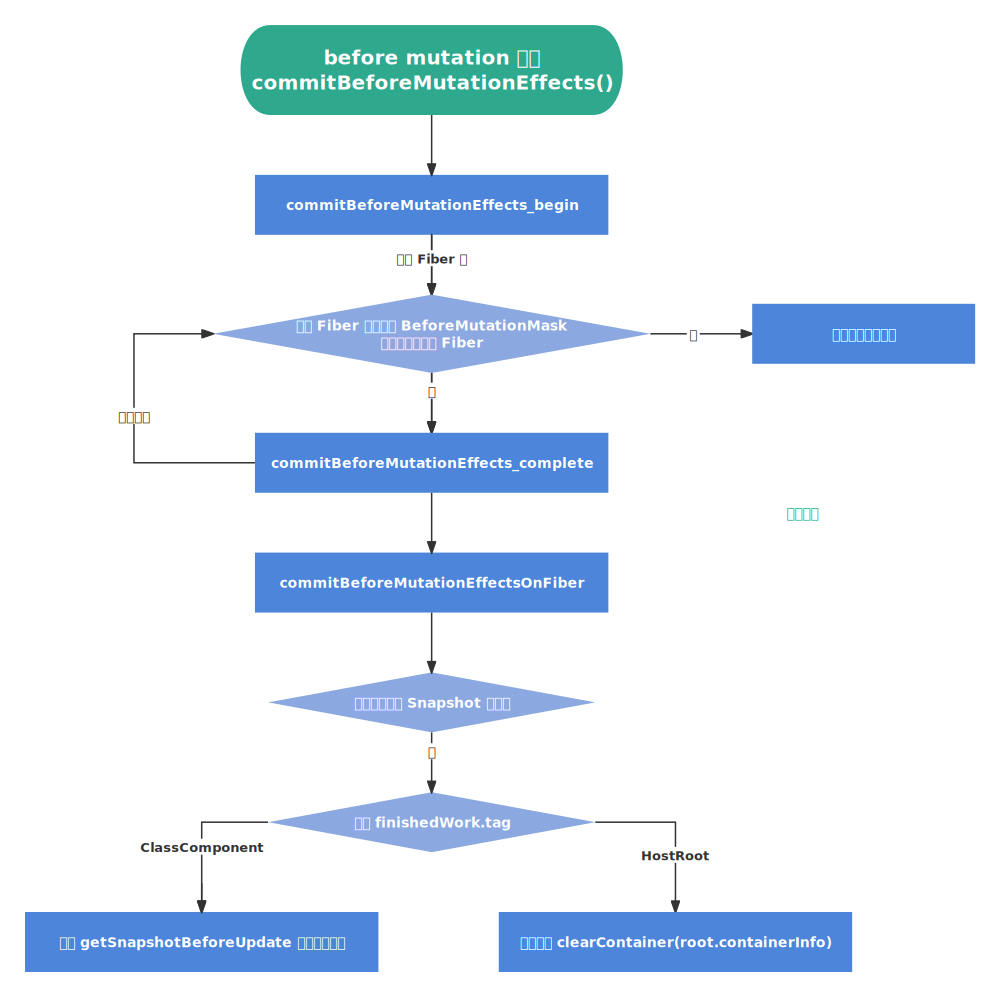

`commitBeforeMutationEffects` [​](#commitbeforemutationeffects)
===============================================================

在 `commitRootImpl()` 中会调用 `commitBeforeMutationEffects`，进入 **before mutation 阶段**（即执行 DOM 操作前）

这个阶段的执行过程和 **render 阶段** 类似，一样存在 **“递”** 和 **“归”** 的逻辑，通过深度优先遍历，找到最后一个有 `BeforeMutationMask` 标记的 Fiber，然后从下往上调用 `complete` 逻辑

> `commitBeforeMutationEffects` 流程图



```ts

    const shouldFireAfterActiveInstanceBlur = commitBeforeMutationEffects(root, finishedWork)

``` 

> 源码地址 [commitBeforeMutationEffects() | react-reconciler/src/ReactFiberCommitWork.old.js](https://github.com/wild2life/code-analysis/blob/f0dc66687fe470217252ef38ae4f0697dc2fc15d/react-v18.2.0/src/react/packages/react-reconciler/src/ReactFiberCommitWork.old.js#L321)

```ts

    export function commitBeforeMutationEffects(
      root: FiberRoot, // 即 fiberRootNode
      firstChild: Fiber // 即 rootFiber
    ) {
      // 根据 enableCreateEventHandleAPI 的值来决定是否启用新的事件处理方式（默认为 false，该函数返回值为 null）
      focusedInstanceHandle = prepareForCommit(root.containerInfo)
    
      nextEffect = firstChild
    
      // 处理 before mutation 阶段的副作用
      commitBeforeMutationEffects_begin()
    
      // We no longer need to track the active instance fiber
      const shouldFire = shouldFireAfterActiveInstanceBlur
      shouldFireAfterActiveInstanceBlur = false
      focusedInstanceHandle = null
    
      return shouldFire
    }
```

`commitBeforeMutationEffects_begin` [​](#commitbeforemutationeffects-begin)
---------------------------------------------------------------------------

> 源码地址 [commitBeforeMutationEffects\_begin() | react-reconciler/src/ReactFiberCommitWork.old.js](https://github.com/wild2life/code-analysis/blob/f0dc66687fe470217252ef38ae4f0697dc2fc15d/react-v18.2.0/src/react/packages/react-reconciler/src/ReactFiberCommitWork.old.js#L338)

```ts

    function commitBeforeMutationEffects_begin() {
      // 对 Fiber 树进行深度优先遍历，当找到符合条件的节点时开始执行对应的操作
      while (nextEffect !== null) {
        const fiber = nextEffect
    
        // This phase is only used for beforeActiveInstanceBlur.
        // Let's skip the whole loop if it's off.
        // enableCreateEventHandleAPI 值为 false 可以忽略
        if (enableCreateEventHandleAPI) {
          // TODO: Should wrap this in flags check, too, as optimization
          const deletions = fiber.deletions
          if (deletions !== null) {
            for (let i = 0; i < deletions.length; i++) {
              const deletion = deletions[i]
              commitBeforeMutationEffectsDeletion(deletion)
            }
          }
        }
    
        const child = fiber.child
    
        // 找最后一个带有 BeforeMutationMask 标识的 Fiber
        if (
          // 判断当前 Fiber 的子 Fiber 树中是否存在 BeforeMutationMask 副作用（即 Update | Snapshot）
          (fiber.subtreeFlags & BeforeMutationMask) !== NoFlags &&
          // 判断当前 Fiber 是否存在子 Fiber
          child !== null
        ) {
          // 更新指针
          child.return = fiber
          nextEffect = child
        } else {
          // 找最后一个带有 BeforeMutationMask 标识的 Fiber 时，进入该 Fiber 的 complete 阶段
          commitBeforeMutationEffects_complete()
        }
      }
    }

```

`commitBeforeMutationEffects_complete` [​](#commitbeforemutationeffects-complete)
---------------------------------------------------------------------------------

> 源码地址 [commitBeforeMutationEffects\_complete() | react-reconciler/src/ReactFiberCommitWork.old.js](https://github.com/wild2life/code-analysis/blob/f0dc66687fe470217252ef38ae4f0697dc2fc15d/react-v18.2.0/src/react/packages/react-reconciler/src/ReactFiberCommitWork.old.js#L368)

```ts

    function commitBeforeMutationEffects_complete() {
      while (nextEffect !== null) {
        const fiber = nextEffect
    
        try {
          // before mutation 阶段的主要函数
          commitBeforeMutationEffectsOnFiber(fiber)
        } catch (error) {
          captureCommitPhaseError(fiber, fiber.return, error)
        }
    
        const sibling = fiber.sibling
        // 判断是否存在兄弟节点
        if (sibling !== null) {
          // 当存在兄弟节点时更新指针并返回到 begin 方法继续向下遍历
          sibling.return = fiber.return
          nextEffect = sibling
          return
        }
    
        // 更新指针为父节点
        nextEffect = fiber.return
      }
    }

```

`commitBeforeMutationEffectsOnFiber` [​](#commitbeforemutationeffectsonfiber)
-----------------------------------------------------------------------------

**before mutation 阶段**的主要函数，其内部会根据 `flags` 的值来判断是否存在 **Snapshot** 副作用，如果存在则会根据 `tag` 的值来执行对应的操作：

1.  执行类组件 `getSnapshotBeforeUpdate` 生命周期函数
2.  对 `rootFiber` 的容器进行清空操作

> 源码地址 [commitBeforeMutationEffectsOnFiber | react-reconciler/src/ReactFiberCommitWork.old.js](https://github.com/wild2life/code-analysis/blob/f0dc66687fe470217252ef38ae4f0697dc2fc15d/react-v18.2.0/src/react/packages/react-reconciler/src/ReactFiberCommitWork.old.js#L390)

```ts

    function commitBeforeMutationEffectsOnFiber(finishedWork: Fiber) {
      const current = finishedWork.alternate
      const flags = finishedWork.flags
    
      // 未开启 enableCreateEventHandleAPI 可忽略
      if (enableCreateEventHandleAPI) {
        if (!shouldFireAfterActiveInstanceBlur && focusedInstanceHandle !== null) {
          // Check to see if the focused element was inside of a hidden (Suspense) subtree.
          // TODO: Move this out of the hot path using a dedicated effect tag.
          if (
            finishedWork.tag === SuspenseComponent &&
            isSuspenseBoundaryBeingHidden(current, finishedWork) &&
            doesFiberContain(finishedWork, focusedInstanceHandle)
          ) {
            shouldFireAfterActiveInstanceBlur = true
            beforeActiveInstanceBlur(finishedWork)
          }
        }
      }
    
      // 判断是否存在 Snapshot 副作用
      if ((flags & Snapshot) !== NoFlags) {
        switch (finishedWork.tag) {
          case FunctionComponent:
          case ForwardRef:
          case SimpleMemoComponent: {
            break
          }
          // 类组件
          case ClassComponent: {
            if (current !== null) {
              const prevProps = current.memoizedProps
              const prevState = current.memoizedState
              const instance = finishedWork.stateNode
              // We could update instance props and state here,
              // but instead we rely on them being set during last render.
              // TODO: revisit this when we implement resuming.
    
              // 执行类组件的 getSnapshotBeforeUpdate 生命周期函数
              const snapshot = instance.getSnapshotBeforeUpdate(
                finishedWork.elementType === finishedWork.type
                  ? prevProps
                  : resolveDefaultProps(finishedWork.type, prevProps),
                prevState
              )
              // 将 getSnapshotBeforeUpdate 的返回值赋值给 __reactInternalSnapshotBeforeUpdate 属性
              instance.__reactInternalSnapshotBeforeUpdate = snapshot
            }
            break
          }
          // rootFiber
          case HostRoot: {
            if (supportsMutation) {
              const root = finishedWork.stateNode
              // 清空容器
              clearContainer(root.containerInfo)
            }
            break
          }
          case HostComponent:
          case HostText:
          case HostPortal:
          case IncompleteClassComponent:
            // Nothing to do for these component types
            break
          default: {
            throw new Error(
              'This unit of work tag should not have side-effects. This error is ' +
                'likely caused by a bug in React. Please file an issue.'
            )
          }
        }
      }
    }

```

