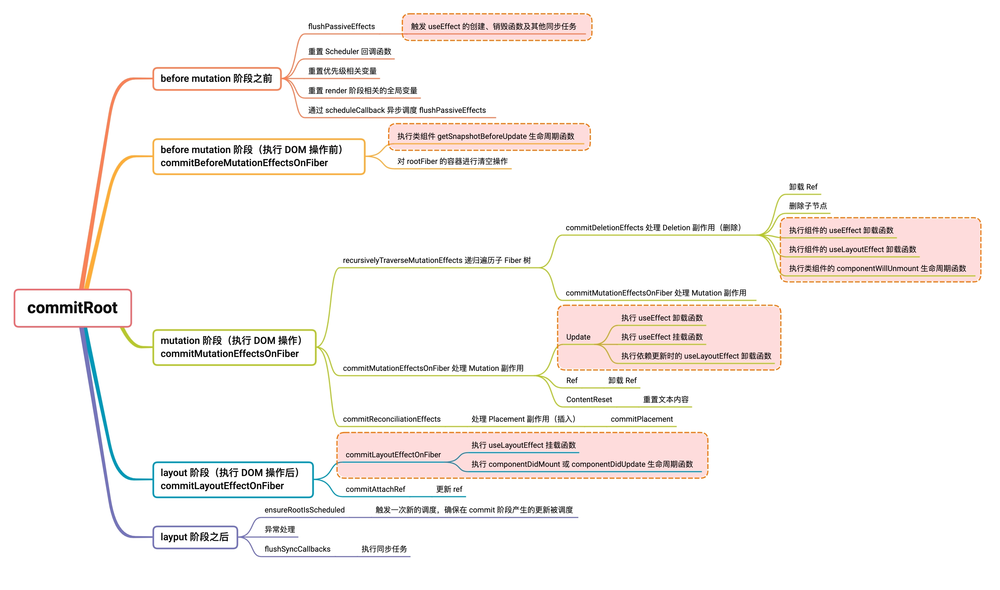

`commitRoot` [​](#commitroot)
=============================

在 **render 阶段**完成更新后，会调用 `commitRoot(root)`（进入 **commit 阶段**）来提交更新。

> `commitRoot` 流程图



`commitRoot(root)` [​](#commitroot-root)
----------------------------------------

`commitRoot` 函数会做一些准备工作，然后调用 `commitRootImpl` 函数完成更新的提交

> 源码地址 [commitRoot | react-reconciler/src/ReactFiberWorkLoop.old.js](https://github.com/wild2life/code-analysis/blob/f0dc66687fe470217252ef38ae4f0697dc2fc15d/react-v18.2.0/src/react/packages/react-reconciler/src/ReactFiberWorkLoop.old.js#L1958)

```ts

    function commitRoot(
      root: FiberRoot,
      recoverableErrors: null | Array<CapturedValue<mixed>>,
      transitions: Array<Transition> | null
    ) {
      // 保存当前更新优先级
      const previousUpdateLanePriority = getCurrentUpdatePriority()
      // 保存当前 transition
      const prevTransition = ReactCurrentBatchConfig.transition
    
      try {
        // 设置 transition 为 null
        ReactCurrentBatchConfig.transition = null
        // 将当前的更新优先级设置为离散事件优先级，也就是不可中断的同步更新（即最高优先级任务
        setCurrentUpdatePriority(DiscreteEventPriority)
    
        // 调用 commitRootImpl 函数完成提交
        commitRootImpl(root, recoverableErrors, transitions, previousUpdateLanePriority)
      } finally {
        // 恢复 transition
        ReactCurrentBatchConfig.transition = prevTransition
        // 恢复之前的更新优先级
        setCurrentUpdatePriority(previousUpdateLanePriority)
      }
    
      return null
    }

```

`commitRootImpl` [​](#commitrootimpl)
-------------------------------------

`commitRootImpl` 函数是 **commit 阶段** 的主要函数，其主要工作（即 Renderer 的工作流程）可以分为三部分：

*   [**before mutation 阶段**](./commit-before-mutation-effects)（执行 DOM 操作前）
*   [**mutation 阶段**](./commit-mutation-effects)（执行 DOM 操作）
*   [**layout 阶段**](./commit-layout-effects)（执行 DOM 操作后）

这三个阶段会

同时在 [**before mutation 阶段之前**](#before-mutation-阶段之前) 和 [**layout 阶段之后**](#layput-阶段之后) 还有一些额外的操作，涉及到比如 `useEffect` 的触发、优先级相关的重置、`ref` 的绑定/解绑等

> 源码地址 [commitRootImpl | react-reconciler/src/ReactFiberWorkLoop.old.js](https://github.com/wild2life/code-analysis/blob/f0dc66687fe470217252ef38ae4f0697dc2fc15d/react-v18.2.0/src/react/packages/react-reconciler/src/ReactFiberWorkLoop.old.js#L1958)

各个阶段的大致划分如下：

```ts

    function commitRootImpl(
      root: FiberRoot, // root 指 FiberRootNode
      recoverableErrors: null | Array<CapturedValue<mixed>>,
      transitions: Array<Transition> | null,
      renderPriorityLevel: EventPriority
    ) {
      /* before mutation 阶段之前 */
      do {
        flushPassiveEffects()
      } while (rootWithPendingPassiveEffects !== null)
    
      // ... 省略大量代码
    
      const subtreeHasEffects =
        (finishedWork.subtreeFlags & (BeforeMutationMask | MutationMask | LayoutMask | PassiveMask)) !==
        NoFlags
      const rootHasEffect =
        (finishedWork.flags & (BeforeMutationMask | MutationMask | LayoutMask | PassiveMask)) !==
        NoFlags
    
      if (subtreeHasEffects || rootHasEffect) {
        // ... 省略大量代码
    
        /* before mutation 阶段主函数 */
        const shouldFireAfterActiveInstanceBlur = commitBeforeMutationEffects(root, finishedWork)
    
        // ... 省略大量代码
    
        /* mutation 阶段主函数 */
        commitMutationEffects(root, finishedWork, lanes)
    
        // ... 省略大量代码
    
        /* layout 阶段主函数 */
        commitLayoutEffects(finishedWork, root, lanes)
    
        // ... 省略大量代码
      } else {
        root.current = finishedWork
      }
    
      /* layout 阶段之后 */
      const rootDidHavePassiveEffects = rootDoesHavePassiveEffects
    
      // ... 省略大量代码
    
      flushSyncCallbacks()
    
      return null
    }

```

### before mutation 阶段之前 [​](#before-mutation-阶段之前)

`commitRootImpl` 函数中直到 [`if (subtreeHasEffects || rootHasEffect)` 判断](https://github.com/wild2life/code-analysis/blob/f0dc66687fe470217252ef38ae4f0697dc2fc15d/react-v18.2.0/src/react/packages/react-reconciler/src/ReactFiberWorkLoop.old.js#L2115)之前都属于 **before mutation 阶段之前**

```ts

    function commitRootImpl(
      root: FiberRoot, // root 指 FiberRootNode
      recoverableErrors: null | Array<CapturedValue<mixed>>,
      transitions: Array<Transition> | null,
      renderPriorityLevel: EventPriority
    ) {
      do {
        // `flushPassiveEffects` will call `flushSyncUpdateQueue` at the end, which
        // means `flushPassiveEffects` will sometimes result in additional
        // passive effects. So we need to keep flushing in a loop until there are
        // no more pending effects.
        // TODO: Might be better if `flushPassiveEffects` did not automatically
        // flush synchronous work at the end, to avoid factoring hazards like this.
        // 触发 useEffect 的创建、销毁函数及其他同步任务
        // 由于执行这些任务时可能触发新的更新任务，所以这里要一直遍历执行直到没有任务为止
        flushPassiveEffects()
      } while (rootWithPendingPassiveEffects !== null)
    
      if ((executionContext & (RenderContext | CommitContext)) !== NoContext) {
        throw new Error('Should not already be working.')
      }
    
      // render 阶段已经构建好的 Fiber 树（即 workInProgress Fiber 树）
      const finishedWork = root.finishedWork
      // 优先级相关
      const lanes = root.finishedLanes
    
      if (enableSchedulingProfiler) {
        markCommitStarted(lanes)
      }
    
      if (finishedWork === null) {
        if (enableSchedulingProfiler) {
          markCommitStopped()
        }
    
        return null
      }
    
      // 清空已完成的工作
      root.finishedWork = null
      root.finishedLanes = NoLanes
    
      if (finishedWork === root.current) {
        throw new Error(
          'Cannot commit the same tree as before. This error is likely caused by ' +
            'a bug in React. Please file an issue.'
        )
      }
    
      // commitRoot never returns a continuation; it always finishes synchronously.
      // So we can clear these now to allow a new callback to be scheduled.
      // 重置 Scheduler 回调函数
      root.callbackNode = null
      root.callbackPriority = NoLane
    
      // Update the first and last pending times on this root. The new first
      // pending time is whatever is left on the root fiber.
      let remainingLanes = mergeLanes(finishedWork.lanes, finishedWork.childLanes)
      // 标记 root 工作已经完成（即重置优先级相关变量）
      markRootFinished(root, remainingLanes)
    
      if (root === workInProgressRoot) {
        // We can reset these now that they are finished.
        // 重置 render 阶段相关的全局变量（因为它们的工作已经完成了）
        workInProgressRoot = null
        workInProgress = null
        workInProgressRootRenderLanes = NoLanes
      } else {
        // This indicates that the last root we worked on is not the same one that
        // we're committing now. This most commonly happens when a suspended root
        // times out.
      }
    
      // If there are pending passive effects, schedule a callback to process them.
      // Do this as early as possible, so it is queued before anything else that
      // might get scheduled in the commit phase. (See #16714.)
      // TODO: Delete all other places that schedule the passive effect callback
      // They're redundant.
      // 检查当前工作单元的 flags 或 subtreeFlags 中是否存在 PassiveMask（Passive | ChildDeletion）相关的副作用
      if (
        (finishedWork.subtreeFlags & PassiveMask) !== NoFlags ||
        (finishedWork.flags & PassiveMask) !== NoFlags
      ) {
        if (!rootDoesHavePassiveEffects) {
          rootDoesHavePassiveEffects = true
          pendingPassiveEffectsRemainingLanes = remainingLanes
          // workInProgressTransitions might be overwritten, so we want
          // to store it in pendingPassiveTransitions until they get processed
          // We need to pass this through as an argument to commitRoot
          // because workInProgressTransitions might have changed between
          // the previous render and commit if we throttle the commit
          // with setTimeout
          pendingPassiveTransitions = transitions
          // 创建调度任务，并以 NormalSchedulerPriority 优先级来执行
          scheduleCallback(NormalSchedulerPriority, () => {
            // 触发 useEffect 的创建、销毁函数及其他同步任务
            flushPassiveEffects()
            // This render triggered passive effects: release the root cache pool
            // *after* passive effects fire to avoid freeing a cache pool that may
            // be referenced by a node in the tree (HostRoot, Cache boundary etc)
            return null
          })
        }
      }
    
      // ... 省略大量代码
    }

```
可以看到在 **before mutation 阶段之前** 主要是做一些**变量赋值和状态重置**的工作

#### `flushPassiveEffects` [​](#flushpassiveeffects)

`flushPassiveEffects` 是处理 `passive effect` 的入口函数

> 源码地址 [flushPassiveEffects | react-reconciler/src/ReactFiberWorkLoop.old.js](https://github.com/wild2life/code-analysis/blob/f0dc66687fe470217252ef38ae4f0697dc2fc15d/react-v18.2.0/src/react/packages/react-reconciler/src/ReactFiberWorkLoop.old.js#L2356)

```ts

    export function flushPassiveEffects(): boolean {
      // Returns whether passive effects were flushed.
      // TODO: Combine this check with the one in flushPassiveEFfectsImpl. We should
      // probably just combine the two functions. I believe they were only separate
      // in the first place because we used to wrap it with
      // `Scheduler.runWithPriority`, which accepts a function. But now we track the
      // priority within React itself, so we can mutate the variable directly.
    
      // 判断是否有待处理的 passive effect
      if (rootWithPendingPassiveEffects !== null) {
        // Cache the root since rootWithPendingPassiveEffects is cleared in
        // flushPassiveEffectsImpl
        const root = rootWithPendingPassiveEffects
        // Cache and clear the remaining lanes flag; it must be reset since this
        // method can be called from various places, not always from commitRoot
        // where the remaining lanes are known
        const remainingLanes = pendingPassiveEffectsRemainingLanes
        pendingPassiveEffectsRemainingLanes = NoLanes
    
        // 将 Lane 优先级转换为事件优先级
        const renderPriority = lanesToEventPriority(pendingPassiveEffectsLanes)
        // 将上一步的 renderPriority 和默认的事件优先级进行对比并取较低的优先级（保证 passive effect 的执行不会打断更高优先级的更新）
        const priority = lowerEventPriority(DefaultEventPriority, renderPriority)
        const prevTransition = ReactCurrentBatchConfig.transition
        const previousPriority = getCurrentUpdatePriority()
    
        try {
          ReactCurrentBatchConfig.transition = null
          setCurrentUpdatePriority(priority)
          // 执行 passive effect 相关的操作
          return flushPassiveEffectsImpl()
        } finally {
          setCurrentUpdatePriority(previousPriority)
          ReactCurrentBatchConfig.transition = prevTransition
    
          // Once passive effects have run for the tree - giving components a
          // chance to retain cache instances they use - release the pooled
          // cache at the root (if there is one)
          releaseRootPooledCache(root, remainingLanes)
        }
      }
      // 表示没有待处理的 passive effect
      return false
    }

``` 

#### `flushPassiveEffectsImpl` [​](#flushpassiveeffectsimpl)

`flushPassiveEffectsImpl` 函数是处理 `passive effect` 的主要函数

> 源码地址 [flushPassiveEffectsImpl | react-reconciler/src/ReactFiberWorkLoop.old.js](https://github.com/wild2life/code-analysis/blob/f0dc66687fe470217252ef38ae4f0697dc2fc15d/react-v18.2.0/src/react/packages/react-reconciler/src/ReactFiberWorkLoop.old.js#L2408)

```ts

    function flushPassiveEffectsImpl() {
      // 判断是否有待处理的 passive effect
      if (rootWithPendingPassiveEffects === null) {
        return false
      }
    
      // Cache and clear the transitions flag
      const transitions = pendingPassiveTransitions
      pendingPassiveTransitions = null
    
      const root = rootWithPendingPassiveEffects
      const lanes = pendingPassiveEffectsLanes
      rootWithPendingPassiveEffects = null
      // TODO: This is sometimes out of sync with rootWithPendingPassiveEffects.
      // Figure out why and fix it. It's not causing any known issues (probably
      // because it's only used for profiling), but it's a refactor hazard.
      pendingPassiveEffectsLanes = NoLanes
    
      // 判断当前当前执行上下文是否为 Commit 上下文或 Render 上下文
      if ((executionContext & (RenderContext | CommitContext)) !== NoContext) {
        throw new Error('Cannot flush passive effects while already rendering.')
      }
    
      // 缓存当前的执行上下文
      const prevExecutionContext = executionContext
      // 设置当前执行上下文为 Commit 上下文
      executionContext |= CommitContext
    
      // 执行 useEffect 的销毁函数（实际是调用 commitHookEffectListUnmount）
      commitPassiveUnmountEffects(root.current)
      // 执行 useEffect 的创建函数（实际是调用 commitHookEffectListMount）
      commitPassiveMountEffects(root, root.current, lanes, transitions)
    
      // 恢复之前的执行上下文
      executionContext = prevExecutionContext
    
      // 刷新同步回调
      flushSyncCallbacks()
    
      return true
    }

```
### 三个主要阶段 [​](#三个主要阶段)

*   [**before mutation 阶段**](./commit-before-mutation-effects)（执行 DOM 操作前）
*   [**mutation 阶段**](./commit-mutation-effects)（执行 DOM 操作）
*   [**layout 阶段**](./commit-layout-effects)（执行 DOM 操作后）

```ts

    function commitRootImpl(
      root: FiberRoot, // root 指 FiberRootNode
      recoverableErrors: null | Array<CapturedValue<mixed>>,
      transitions: Array<Transition> | null,
      renderPriorityLevel: EventPriority
    ) {
      // ... 省略 before mutation 阶段之前的代码
    
      // Check if there are any effects in the whole tree.
      // TODO: This is left over from the effect list implementation, where we had
      // to check for the existence of `firstEffect` to satisfy Flow. I think the
      // only other reason this optimization exists is because it affects profiling.
      // Reconsider whether this is necessary.
      // 检查子节点中是否存在副作用
      const subtreeHasEffects =
        (finishedWork.subtreeFlags & (BeforeMutationMask | MutationMask | LayoutMask | PassiveMask)) !==
        NoFlags
      // 检查根节点中是否存在副作用
      const rootHasEffect =
        (finishedWork.flags & (BeforeMutationMask | MutationMask | LayoutMask | PassiveMask)) !==
        NoFlags
    
      if (subtreeHasEffects || rootHasEffect) {
        // 保存当前 transition 和更新优先级
        const prevTransition = ReactCurrentBatchConfig.transition
        ReactCurrentBatchConfig.transition = null
        const previousPriority = getCurrentUpdatePriority()
        // 将当前的更新优先级设置为离散事件优先级，也就是不可中断的同步更新（即最高优先级任务
        setCurrentUpdatePriority(DiscreteEventPriority)
    
        // 保存当前执行上下文
        const prevExecutionContext = executionContext
        // 设置当前执行上下文为 Commit 上下文
        executionContext |= CommitContext
    
        // Reset this to null before calling lifecycles
        ReactCurrentOwner.current = null
    
        // The commit phase is broken into several sub-phases. We do a separate pass
        // of the effect list for each phase: all mutation effects come before all
        // layout effects, and so on.
    
        // The first phase a "before mutation" phase. We use this phase to read the
        // state of the host tree right before we mutate it. This is where
        // getSnapshotBeforeUpdate is called.
        // 进入 commitBeforeMutationEffects 阶段，执行 DOM 操作前
        const shouldFireAfterActiveInstanceBlur = commitBeforeMutationEffects(root, finishedWork)
    
        if (enableProfilerTimer) {
          // Mark the current commit time to be shared by all Profilers in this
          // batch. This enables them to be grouped later.
          recordCommitTime()
        }
    
        if (enableProfilerTimer && enableProfilerNestedUpdateScheduledHook) {
          // Track the root here, rather than in commitLayoutEffects(), because of ref setters.
          // Updates scheduled during ref detachment should also be flagged.
          rootCommittingMutationOrLayoutEffects = root
        }
    
        // The next phase is the mutation phase, where we mutate the host tree.
        // 进入 mutation 阶段，执行 DOM 操作后
        commitMutationEffects(root, finishedWork, lanes)
    
        if (enableCreateEventHandleAPI) {
          if (shouldFireAfterActiveInstanceBlur) {
            afterActiveInstanceBlur()
          }
        }
        resetAfterCommit(root.containerInfo)
    
        // The work-in-progress tree is now the current tree. This must come after
        // the mutation phase, so that the previous tree is still current during
        // componentWillUnmount, but before the layout phase, so that the finished
        // work is current during componentDidMount/Update.
        // 修改 current 指针
        root.current = finishedWork
    
        // The next phase is the layout phase, where we call effects that read
        // the host tree after it's been mutated. The idiomatic use case for this is
        // layout, but class component lifecycles also fire here for legacy reasons.
        if (enableSchedulingProfiler) {
          markLayoutEffectsStarted(lanes)
        }
        // 进入 layout 阶段，执行 DOM 操作
        commitLayoutEffects(finishedWork, root, lanes)
    
        if (enableSchedulingProfiler) {
          markLayoutEffectsStopped()
        }
    
        if (enableProfilerTimer && enableProfilerNestedUpdateScheduledHook) {
          rootCommittingMutationOrLayoutEffects = null
        }
    
        // Tell Scheduler to yield at the end of the frame, so the browser has an
        // opportunity to paint.
        requestPaint()
    
        // 将执行上下文修改为之前的上下文
        executionContext = prevExecutionContext
    
        // Reset the priority to the previous non-sync value.
        // 恢复之前的更新优先级和 transition
        setCurrentUpdatePriority(previousPriority)
        ReactCurrentBatchConfig.transition = prevTransition
      } else {
        // No effects.
        // 修改 current 指针
        root.current = finishedWork
        // Measure these anyway so the flamegraph explicitly shows that there were
        // no effects.
        // TODO: Maybe there's a better way to report this.
        if (enableProfilerTimer) {
          recordCommitTime()
        }
      }
    
      // ... 省略 layput 阶段之后的代码
    }

``` 

可以看到，当存在副作用时会触发三个子阶段再更新 `current` 指针，否则直接更新 `current` 指针

### layput 阶段之后 [​](#layput-阶段之后)

``` ts

    function commitRootImpl(
      root: FiberRoot, // root 指 FiberRootNode
      recoverableErrors: null | Array<CapturedValue<mixed>>,
      transitions: Array<Transition> | null,
      renderPriorityLevel: EventPriority
    ) {
      // ... 省略大量代码
    
      const rootDidHavePassiveEffects = rootDoesHavePassiveEffects
    
      // 判断本次 commit 是否存在副作用
      if (rootDoesHavePassiveEffects) {
        // This commit has passive effects. Stash a reference to them. But don't
        // schedule a callback until after flushing layout work.
        rootDoesHavePassiveEffects = false
        // 保证下次执行该函数时，开头的 do while 能继续执行
        rootWithPendingPassiveEffects = root
        pendingPassiveEffectsLanes = lanes
      } else {
        // There were no passive effects, so we can immediately release the cache
        // pool for this render.
        //
        releaseRootPooledCache(root, remainingLanes)
      }
    
      // Read this again, since an effect might have updated it
      remainingLanes = root.pendingLanes
    
      // Check if there's remaining work on this root
      // TODO: This is part of the `componentDidCatch` implementation. Its purpose
      // is to detect whether something might have called setState inside
      // `componentDidCatch`. The mechanism is known to be flawed because `setState`
      // inside `componentDidCatch` is itself flawed — that's why we recommend
      // `getDerivedStateFromError` instead. However, it could be improved by
      // checking if remainingLanes includes Sync work, instead of whether there's
      // any work remaining at all (which would also include stuff like Suspense
      // retries or transitions). It's been like this for a while, though, so fixing
      // it probably isn't that urgent.
      if (remainingLanes === NoLanes) {
        // If there's no remaining work, we can clear the set of already failed
        // error boundaries.
        legacyErrorBoundariesThatAlreadyFailed = null
      }
    
      // Always call this before exiting `commitRoot`, to ensure that any
      // additional work on this root is scheduled.
      // 在退出 commitRoot 函数前触发一次新的调度，确保在 commit 阶段产生的更新被调度
      ensureRootIsScheduled(root, now())
    
      // 错误处理
      if (recoverableErrors !== null) {
        // There were errors during this render, but recovered from them without
        // needing to surface it to the UI. We log them here.
        const onRecoverableError = root.onRecoverableError
        for (let i = 0; i < recoverableErrors.length; i++) {
          const recoverableError = recoverableErrors[i]
          const componentStack = recoverableError.stack
          const digest = recoverableError.digest
          onRecoverableError(recoverableError.value, { componentStack, digest })
        }
      }
    
      // 如果有未捕获的错误，抛出它并终止渲染
      if (hasUncaughtError) {
        hasUncaughtError = false
        const error = firstUncaughtError
        firstUncaughtError = null
        throw error
      }
    
      // If the passive effects are the result of a discrete render, flush them
      // synchronously at the end of the current task so that the result is
      // immediately observable. Otherwise, we assume that they are not
      // order-dependent and do not need to be observed by external systems, so we
      // can wait until after paint.
      // TODO: We can optimize this by not scheduling the callback earlier. Since we
      // currently schedule the callback in multiple places, will wait until those
      // are consolidated.
      if (includesSomeLane(pendingPassiveEffectsLanes, SyncLane) && root.tag !== LegacyRoot) {
        flushPassiveEffects()
      }
    
      // Read this again, since a passive effect might have updated it
      remainingLanes = root.pendingLanes
      if (includesSomeLane(remainingLanes, SyncLane)) {
        if (enableProfilerTimer && enableProfilerNestedUpdatePhase) {
          markNestedUpdateScheduled()
        }
    
        // Count the number of times the root synchronously re-renders without
        // finishing. If there are too many, it indicates an infinite update loop.
        // 这里记录一次同步任务的执行次数
        if (root === rootWithNestedUpdates) {
          nestedUpdateCount++
        } else {
          nestedUpdateCount = 0
          rootWithNestedUpdates = root
        }
      } else {
        nestedUpdateCount = 0
      }
    
      // If layout work was scheduled, flush it now.
      // 执行同步任务，这样同步任务不需要等到下次事件循环再执行
      // 在 componentDidMount 中的 setState 和 useLayoutEffect 中的更新都会在这里被同步执行
      flushSyncCallbacks()
    
      if (enableSchedulingProfiler) {
        markCommitStopped()
      }
    
      return null
    }

``` 

可以看到在 **layput 阶段之后** 主要做了以下工作：

*   变量重置
*   开启新的调度
*   异常捕获处理
*   执行同步任务

