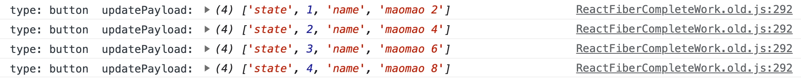

`completeWork` “归” 阶段 [​](#completework-归-阶段)
=============================================

`performUnitOfWork` 函数每次会调用 `beginWork` 来创建当前节点的子节点，如果当前节点没有子节点，则说明当前节点是一个叶子节点。在前面我们已经知道，当遍历到叶子节点时说明当前节点 **“递”阶段** 的工作已经完成，接下来就要进入 **“归” 阶段** ，即通过 `completeUnitOfWork` 执行当前节点对应的 `completeWork` 逻辑

> completeUnitOfWork 流程图


`completeUnitOfWork` [​](#completeunitofwork)
---------------------------------------------

`completeUnitOfWork` 函数的作用是执行当前 Fiber 节点的 `completeWork` 逻辑，然后将 `workInProgress` 赋值为当前节点的兄弟节点或父节点

> 源码地址 [completeUnitOfWork | react-reconciler/src/ReactFiberWorkLoop.old.js](https://github.com/wild2life/code-analysis/blob/f0dc66687fe470217252ef38ae4f0697dc2fc15d/react-v18.2.0/src/react/packages/react-reconciler/src/ReactFiberWorkLoop.old.js#L1859)

``` ts

    function completeUnitOfWork(unitOfWork: Fiber): void {
      let completedWork = unitOfWork
      do {
        // 当前 Fiber 节点的 alternate 属性指向上一次渲染的 Fiber 节点
        const current = completedWork.alternate
        // 父节点
        const returnFiber = completedWork.return
    
        // 检查工作是否完成或抛出了错误
        if ((completedWork.flags & Incomplete) === NoFlags) {
          setCurrentDebugFiberInDEV(completedWork)
          let next
          // 是否启用了 Profiler
          if (!enableProfilerTimer || (completedWork.mode & ProfileMode) === NoMode) {
            // 执行 completeWork 函数
            next = completeWork(current, completedWork, subtreeRenderLanes)
          } else {
            startProfilerTimer(completedWork)
            next = completeWork(current, completedWork, subtreeRenderLanes)
            // Update render duration assuming we didn't error.
            stopProfilerTimerIfRunningAndRecordDelta(completedWork, false)
          }
          resetCurrentDebugFiberInDEV()
    
          if (next !== null) {
            // Completing this fiber spawned new work. Work on that next.
            workInProgress = next
            return
          }
        } else {
          // ... 省略大量代码
        }
    
        const siblingFiber = completedWork.sibling
        //  如果存在兄弟节点，则将 workInProgress 赋值为当前节点的兄弟节点
        if (siblingFiber !== null) {
          workInProgress = siblingFiber
          // return 以后会继续执行 performUnitOfWork 函数，然后进入兄弟节点的 beginWork 阶段
          return
        }
        // 若兄弟节点不存在，则说明当前节点的子节点已经遍历完毕，需要返回到父节点
        completedWork = returnFiber
        // 将 workInProgress 赋值为父节点
        workInProgress = completedWork
      } while (completedWork !== null)
    
      // We've reached the root.
      if (workInProgressRootExitStatus === RootInProgress) {
        workInProgressRootExitStatus = RootCompleted
      }
    }

``` 
`completeWork` [​](#completework)
---------------------------------

类似 `beginWork`，`completeWork` 也是根据 `fiber.tag` 来调用不同的处理逻辑（重点分析 `HostComponent` 的逻辑）

> 源码地址 [completeWork | react-reconciler/src/ReactFiberCompleteWork.old.js](https://github.com/wild2life/code-analysis/blob/f0dc66687fe470217252ef38ae4f0697dc2fc15d/react-v18.2.0/src/react/packages/react-reconciler/src/ReactFiberCompleteWork.old.js#L849)

``` ts

    function completeWork(
      current: Fiber | null,
      workInProgress: Fiber,
      renderLanes: Lanes,
    ): Fiber | null {
      const newProps = workInProgress.pendingProps
    
      switch (workInProgress.tag) {
        case IndeterminateComponent:
        case LazyComponent:
        case SimpleMemoComponent:
        case FunctionComponent:
        case ForwardRef:
        case Fragment:
        case Mode:
        case Profiler:
        case ContextConsumer:
        case MemoComponent:
        case ClassComponent: {
          // ... 省略大量代码
          return null
        }
        case HostRoot: {
          // ... 省略大量代码
          updateHostContainer(current, workInProgress)
          return null
        }
        // 普通 DOM 标签（重点分析）
        case HostComponent: {
          popHostContext(workInProgress)
          const rootContainerInstance = getRootHostContainer()
          const type = workInProgress.type
    
          // 通过判断 current 来区分 mount 还是 update
          if (current !== null && workInProgress.stateNode != null) {
            // update 阶段
            updateHostComponent(current, workInProgress, type, newProps, rootContainerInstance)
    
            if (current.ref !== workInProgress.ref) {
              markRef(workInProgress)
            }
          } else {
            // mount 阶段
            if (!newProps) {
              if (workInProgress.stateNode === null) {
                throw new Error(
                  'We must have new props for new mounts. This error is likely ' +
                    'caused by a bug in React. Please file an issue.',
                )
              }
    
              // This can happen when we abort work.
              bubbleProperties(workInProgress)
              return null
            }
    
            const currentHostContext = getHostContext()
    
            // 判断是不是服务端渲染
            const wasHydrated = popHydrationState(workInProgress)
            if (wasHydrated) {
              if (
                prepareToHydrateHostInstance(workInProgress, rootContainerInstance, currentHostContext)
              ) {
                // If changes to the hydrated node need to be applied at the
                // commit-phase we mark this as such.
                markUpdate(workInProgress)
              }
            } else {
              // 为 Fiber 节点创建对应的 DOM 节点
              const instance = createInstance(
                type,
                newProps,
                rootContainerInstance,
                currentHostContext,
                workInProgress,
              )
    
              // 将子孙 DOM 节点插入刚生成的 DOM 节点中
              appendAllChildren(instance, workInProgress, false, false)
    
              // 将 DOM 节点赋值给 fiber.stateNode
              workInProgress.stateNode = instance
    
              if (
                // 为 DOM 节点添加属性
                finalizeInitialChildren(
                  instance,
                  type,
                  newProps,
                  rootContainerInstance,
                  currentHostContext,
                )
              ) {
                markUpdate(workInProgress)
              }
            }
    
            if (workInProgress.ref !== null) {
              // If there is a ref on a host node we need to schedule a callback
              markRef(workInProgress)
            }
          }
          bubbleProperties(workInProgress)
          return null
        }
    
        // ... 以下 case 省略大量代码
        case HostText:
        case SuspenseComponent:
        case HostPortal:
        case ContextProvider:
        case IncompleteClassComponent:
        case SuspenseListComponent:
        case ScopeComponent:
        case OffscreenComponent:
        case LegacyHiddenComponent:
        case CacheComponent:
        case TracingMarkerComponent:
          return null
      }
    
      throw new Error(
        `Unknown unit of work tag (${workInProgress.tag}). This error is likely caused by a bug in ` +
          'React. Please file an issue.',
      )
    }

```  

`bubbleProperties` 函数的作用

`bubbleProperties` 函数通过检查 `fiber.child` 及其兄弟节点 `fiber.child.sibling` 来更新 `subtreeFlags` 和 `childLanes`，以标记子树的更新状态。这样就可以通过 `fiber.subtreeFlags` 的值来快速判断子树是否包含副作用钩子，避免了深度遍历整个子树的开销

`mount` 阶段 [​](#mount-阶段)
-------------------------

### `createInstance` [​](#createinstance)

`createInstance` 函数的作用是为 Fiber 节点创建对应的 DOM 节点

> 源码地址 [createInstance | react-dom/src/client/ReactDOMHostConfig.js](https://github.com/wild2life/code-analysis/blob/f0dc66687fe470217252ef38ae4f0697dc2fc15d/react-v18.2.0/src/react/packages/react-dom/src/client/ReactDOMHostConfig.js#L243)

``` ts

    function createInstance(
      type: string,
      props: Props,
      rootContainerInstance: Container,
      hostContext: HostContext,
      internalInstanceHandle: Object,
    ): Instance {
      let parentNamespace: string
      if (__DEV__) {
        // ... 省略 DEV 环境下的代码
      } else {
        parentNamespace = hostContext
      }
      // 创建 DOM 节点
      const domElement: Instance = createElement(type, props, rootContainerInstance, parentNamespace)
      // 将当前 Fiber 节点挂载到 DOM 节点上
      precacheFiberNode(internalInstanceHandle, domElement)
      // 将当前的 props 挂载到 DOM 节点
      updateFiberProps(domElement, props)
      return domElement
    }

``` 
### `appendAllChildren` [​](#appendallchildren)

`appendAllChildren` 函数会遍历传入的 `workInProgress` 的子节点，并将这些子节点的 `stateNode` 插入到父节点中

> 源码地址 [appendAllChildren | react-reconciler/src/ReactFiberCompleteWork.old.js](https://github.com/wild2life/code-analysis/blob/f0dc66687fe470217252ef38ae4f0697dc2fc15d/react-v18.2.0/src/react/packages/react-reconciler/src/ReactFiberCompleteWork.old.js#L214)

``` ts

    appendAllChildren = function (
      parent: Instance,
      workInProgress: Fiber,
      needsVisibilityToggle: boolean,
      isHidden: boolean,
    ) {
      // 遍历 workInProgress 的子节点
      let node = workInProgress.child
      while (node !== null) {
        if (node.tag === HostComponent || node.tag === HostText) {
          // 如果当前节点是 DOM 节点或文本节点，则将其直接插入到父节点中
          appendInitialChild(parent, node.stateNode)
        } else if (node.tag === HostPortal) {
          // If we have a portal child, then we don't want to traverse
          // down its children. Instead, we'll get insertions from each child in
          // the portal directly.
          // 如果当前节点是 HostPortal 则不需要遍历其子节点
        } else if (node.child !== null) {
          // 如果当前节点不是 DOM 节点或文本节点且存在子节点
          // 则将子节点的 return 属性指向当前节点，然后继续遍历处理子节点
          node.child.return = node
          node = node.child
          continue
        }
    
        // 当遍历结果为 workInProgress 时说明当前节点的子节点已经遍历完毕
        if (node === workInProgress) {
          return
        }
    
        // 遍历找到当前节点的下一个兄弟节点
        while (node.sibling === null) {
          // 当前节点没有父节点或父节点是 workInProgress 时遍历结束
          if (node.return === null || node.return === workInProgress) {
            return
          }
          // 向上迭代至父节点，寻找有兄弟节点的节点
          node = node.return
        }
        // 将兄弟节点的 return 指向同一个父节点
        node.sibling.return = node.return
        // 继续遍历处理下一个兄弟节点
        node = node.sibling
      }
    }

``` 
### `finalizeInitialChildren` [​](#finalizeinitialchildren)

`finalizeInitialChildren` 函数会调用 `setInitialProperties` 来进行属性和事件的设置，然后根据 DOM 节点的类型来判断是否需要聚焦

> 源码地址 [finalizeInitialChildren | react-dom/src/client/ReactDOMHostConfig.js](https://github.com/wild2life/code-analysis/blob/f0dc66687fe470217252ef38ae4f0697dc2fc15d/react-v18.2.0/src/react/packages/react-dom/src/client/ReactDOMHostConfig.js#L288)

``` ts

    function finalizeInitialChildren(
      domElement: Instance,
      type: string,
      props: Props,
      rootContainerInstance: Container,
      hostContext: HostContext,
    ): boolean {
      // 属性和事件的设置
      setInitialProperties(domElement, type, props, rootContainerInstance)
    
      // 是否需要聚焦
      switch (type) {
        case 'button':
        case 'input':
        case 'select':
        case 'textarea':
          return !!props.autoFocus
        case 'img':
          return true
        default:
          return false
      }
    }

``` 
#### `setInitialProperties` [​](#setinitialproperties)

`setInitialProperties` 函数用于设置 DOM 节点的属性以及事件监听

> [源码地址 setInitialProperties | react-dom/src/client/ReactDOMComponent.js](https://github.com/wild2life/code-analysis/blob/f0dc66687fe470217252ef38ae4f0697dc2fc15d/react-v18.2.0/src/react/packages/react-dom/src/client/ReactDOMComponent.js#L486)

``` ts

    function setInitialProperties(
      domElement: Element,
      tag: string,
      rawProps: Object,
      rootContainerElement: Element | Document | DocumentFragment,
    ): void {
      // 判断是否为自定义组件
      const isCustomComponentTag = isCustomComponent(tag, rawProps)
    
      let props: Object
      // 根据 tag 来处理不同的事件和属性
      switch (
        tag
        // ... 省略大量代码
      ) {
      }
    
      // 校验 props 是否合法
      assertValidProps(tag, props)
    
      // 设置 DOM 节点的属性
      setInitialDOMProperties(tag, domElement, rootContainerElement, props, isCustomComponentTag)
    
      // 对特定标签进行后续处理
      switch (tag) {
        case 'input':
          track(domElement)
          ReactDOMInputPostMountWrapper(domElement, rawProps, false)
          break
        // ... 省略大量代码
        case 'textarea':
        case 'option':
        case 'select':
        default:
          if (typeof props.onClick === 'function') {
            trapClickOnNonInteractiveElement(domElement)
          }
          break
      }
    }

``` 

`update` 阶段 [​](#update-阶段)
---------------------------

*   `updateHostContainer` 处理根节点
*   `updateHostComponent` 处理普通 DOM 节点
*   `updateHostText` 处理文本节点

> 这里只分析 `updateHostComponent`

### `updateHostComponent` [​](#updatehostcomponent)

> 源码地址 [updateHostComponent | react-reconciler/src/ReactFiberCompleteWork.old.js](https://github.com/wild2life/code-analysis/blob/f0dc66687fe470217252ef38ae4f0697dc2fc15d/react-v18.2.0/src/react/packages/react-reconciler/src/ReactFiberCompleteWork.old.js#L252)

``` ts

    updateHostComponent = function (
      current: Fiber,
      workInProgress: Fiber,
      type: Type,
      newProps: Props,
      rootContainerInstance: Container,
    ) {
      // If we have an alternate, that means this is an update and we need to
      // schedule a side-effect to do the updates.
      const oldProps = current.memoizedProps
      if (oldProps === newProps) {
        // In mutation mode, this is sufficient for a bailout because
        // we won't touch this node even if children changed.
        return
      }
    
      // If we get updated because one of our children updated, we don't
      // have newProps so we'll have to reuse them.
      // TODO: Split the update API as separate for the props vs. children.
      // Even better would be if children weren't special cased at all tho.
      const instance: Instance = workInProgress.stateNode
      const currentHostContext = getHostContext()
    
      // 对比新旧 props 的差异，生成更新 payload
      const updatePayload = prepareUpdate(
        instance,
        type,
        oldProps,
        newProps,
        rootContainerInstance,
        currentHostContext,
      )
      workInProgress.updateQueue = updatePayload
    
      // 如果 payload 存在，标记当前节点需要更新（所有的更新操作在 commitWork 阶段执行）
      if (updatePayload) {
        markUpdate(workInProgress)
      }
    }

``` 

`updatePayload` 的值是一个数组

*   偶数索引的值为变化的 `prop key`
*   奇数索引的值为变化的 `prop value`

> 以下面的代码举 🌰

``` tsx

    function UpdatePayload() {
      const [state, setState] = useState(0)
    
      return (
        <button state={state} name={`maomao ${state * 2}`} onClick={() => setState((v) => v + 1)}>
          点击 +1
        </button>
      )
    }

``` 


