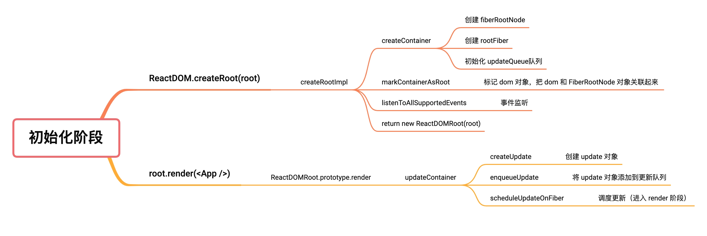

初始化阶段 [​](#初始化阶段)
=================

以下面的代码举 🌰，来看看 React 的初始化阶段是如何进行的

```js

    import React from 'react'
    import ReactDOM from 'react-dom/client'
    import App from './App'
    
    const root = ReactDOM.createRoot(document.getElementById('root'))
    root.render(<App />)

```
> 初始化阶段的调用链路图



`ReactDOM.createRoot` [​](#reactdom-createroot)
-----------------------------------------------

`ReactDOM.createRoot` 方法是 React 应用初始化的入口，其作用是进行一些初始化操作，最后返回一个 `ReactDOMRoot` 实例，该实例上有一个 `render` 方法用于渲染根组件。其大致流程如下：

1.  校验 `container` 是否合法
2.  处理 `options` 参数
3.  创建 `FiberRootNode` 和 `RootFiber`
4.  标记 `dom` 对象，把 `dom` 和 `FiberRootNode` 对象关联起来
5.  初始化更新队列
6.  监听所有支持的事件
7.  返回一个 `ReactDOMRoot` 实例

### `createRoot` [​](#createroot)

> 源码地址 [createRoot | react-dom/src/client/ReactDOMRoot.js](https://github.com/wild2life/code-analysis/blob/f0dc66687fe470217252ef38ae4f0697dc2fc15d/react-v18.2.0/src/react/packages/react-dom/src/client/ReactDOMRoot.js#L166)

```ts

    export function createRoot(
      container: Element | Document | DocumentFragment,
      options?: CreateRootOptions
    ): RootType {
      // 校验容器元素 container 是否合法
      if (!isValidContainer(container)) {
        throw new Error('createRoot(...): Target container is not a DOM element.')
      }
    
      let isStrictMode = false // 是否是严格模式
      let concurrentUpdatesByDefaultOverride = false // 是否允许并发更新
      let identifierPrefix = '' // 标识符前缀
      let onRecoverableError = defaultOnRecoverableError // 错误处理函数
      let transitionCallbacks = null // 过渡回调函数
    
      // 处理 options 参数
      if (options !== null && options !== undefined) {
        if (options.unstable_strictMode === true) {
          isStrictMode = true
        }
        if (allowConcurrentByDefault && options.unstable_concurrentUpdatesByDefault === true) {
          concurrentUpdatesByDefaultOverride = true
        }
        if (options.identifierPrefix !== undefined) {
          identifierPrefix = options.identifierPrefix
        }
        if (options.onRecoverableError !== undefined) {
          onRecoverableError = options.onRecoverableError
        }
        if (options.transitionCallbacks !== undefined) {
          transitionCallbacks = options.transitionCallbacks
        }
      }
    
      // 创建 FiberRootNode  和 RootFiber
      const root = createContainer(
        container,
        ConcurrentRoot,
        null,
        isStrictMode,
        concurrentUpdatesByDefaultOverride,
        identifierPrefix,
        onRecoverableError,
        transitionCallbacks
      )
    
      /**
       * 标记 dom 对象，把 dom 和 RootFiber 对象关联起来
       * 将 root.current 挂载到 container 的 _reactRootContainer 属性上
       */
      markContainerAsRoot(root.current, container)
    
      const rootContainerElement: Document | Element | DocumentFragment =
        container.nodeType === COMMENT_NODE ? (container.parentNode: any) : container
    
      // 监听所有支持的事件
      listenToAllSupportedEvents(rootContainerElement)
    
      // 返回一个 ReactDOMRoot 实例
      return new ReactDOMRoot(root)
    }

```  

```ts

    function ReactDOMRoot(internalRoot: FiberRoot) {
      this._internalRoot = internalRoot
    }

``` 

### `createContainer` [​](#createcontainer)

> 源码地址 [createContainer | react-reconciler/src/ReactFiberReconciler.old.js](https://github.com/wild2life/code-analysis/blob/f0dc66687fe470217252ef38ae4f0697dc2fc15d/react-v18.2.0/src/react/packages/react-reconciler/src/ReactFiberReconciler.old.js#L247)

```ts

    export function createContainer(
      containerInfo: Container,
      tag: RootTag,
      hydrationCallbacks: null | SuspenseHydrationCallbacks,
      isStrictMode: boolean,
      concurrentUpdatesByDefaultOverride: null | boolean,
      identifierPrefix: string,
      onRecoverableError: (error: mixed) => void,
      transitionCallbacks: null | TransitionTracingCallbacks,
    ): OpaqueRoot {
      const hydrate = false
      const initialChildren = null
      return createFiberRoot(
        containerInfo,
        tag,
        hydrate,
        initialChildren,
        hydrationCallbacks,
        isStrictMode,
        concurrentUpdatesByDefaultOverride,
        identifierPrefix,
        onRecoverableError,
        transitionCallbacks,
      )
    }
```

### `createFiberRoot` [​](#createfiberroot)

> 源码地址 [createFiberRoot | react-reconciler/src/ReactFiberRoot.old.js](https://github.com/wild2life/code-analysis/blob/f0dc66687fe470217252ef38ae4f0697dc2fc15d/react-v18.2.0/src/react/packages/react-reconciler/src/ReactFiberRoot.old.js#L132)

```ts

    export function createFiberRoot(
      containerInfo: any,
      tag: RootTag,
      hydrate: boolean,
      initialChildren: ReactNodeList,
      hydrationCallbacks: null | SuspenseHydrationCallbacks,
      isStrictMode: boolean,
      concurrentUpdatesByDefaultOverride: null | boolean,
      identifierPrefix: string,
      onRecoverableError: null | ((error: mixed) => void),
      transitionCallbacks: null | TransitionTracingCallbacks,
    ): FiberRoot {
      // 创建 FiberRootNode
      const root: FiberRoot = (new FiberRootNode(
        containerInfo,
        tag,
        hydrate,
        identifierPrefix,
        onRecoverableError,
      ): any);
      if (enableSuspenseCallback) {
        root.hydrationCallbacks = hydrationCallbacks;
      }
    
      if (enableTransitionTracing) {
        root.transitionCallbacks = transitionCallbacks;
      }
    
      // 创建 RootFiber
      const uninitializedFiber = createHostRootFiber(
        tag,
        isStrictMode,
        concurrentUpdatesByDefaultOverride,
      );
    
      // 设置 FiberRootNode 的 current 属性为 RootFiber
      root.current = uninitializedFiber;
      // 设置 RootFiber 的 stateNode 属性为 FiberRootNode
      uninitializedFiber.stateNode = root;
    
      if (enableCache) {
        const initialCache = createCache();
        retainCache(initialCache);
    
        root.pooledCache = initialCache;
        retainCache(initialCache);
        const initialState: RootState = {
          element: initialChildren,
          isDehydrated: hydrate,
          cache: initialCache,
          transitions: null,
          pendingSuspenseBoundaries: null,
        };
        uninitializedFiber.memoizedState = initialState;
      } else {
        const initialState: RootState = {
          element: initialChildren,
          isDehydrated: hydrate,
          cache: null, // not enabled yet
          transitions: null,
          pendingSuspenseBoundaries: null,
        };
        uninitializedFiber.memoizedState = initialState;
      }
    
      // 初始化更新队列
      initializeUpdateQueue(uninitializedFiber);
    
      return root;
    }

```

`root.render` [​](#root-render)
-------------------------------

`root.render` 调用的是一个原型方法 `ReactDOMRoot.prototype.render`

### `ReactDOMRoot.prototype.render` [​](#reactdomroot-prototype-render)

当初始化工作完成以后，会调用 `updateContainer` 开启更新

> 源码地址 [ReactDOMRoot.prototype.render | react-dom/src/client/ReactDOMRoot.js](https://github.com/wild2life/code-analysis/blob/f0dc66687fe470217252ef38ae4f0697dc2fc15d/react-v18.2.0/src/react/packages/react-dom/src/client/ReactDOMRoot.js#L92)

```ts

    ReactDOMRoot.prototype.render = function (children: ReactNodeList): void {
      const root = this._internalRoot
      if (root === null) {
        throw new Error('Cannot update an unmounted root.')
      }
      // 调用 updateContainer 进行更新
      updateContainer(children, root, null, null)
    }
``` 

### `updateContainer` [​](#updatecontainer)

`updateContainer` 函数其大致流程如下：

1.  创建 `update` 对象
2.  将 `update` 对象添加到 `fiber` 的 `updateQueue` 中
3.  调用 `scheduleUpdateOnFiber` 开启更新

> 源码地址 [updateContainer | react-reconciler/src/ReactFiberReconciler.old.js](https://github.com/wild2life/code-analysis/blob/f0dc66687fe470217252ef38ae4f0697dc2fc15d/react-v18.2.0/src/react/packages/react-reconciler/src/ReactFiberReconciler.old.js#L321)

```ts

    export function updateContainer(
      element: ReactNodeList,
      container: OpaqueRoot,
      parentComponent: ?React$Component<any, any>,
      callback: ?Function
    ): Lane {
      const current = container.current
      const eventTime = requestEventTime() // 获取当前时间戳
      const lane = requestUpdateLane(current) // 计算本次更新的优先级
    
      if (enableSchedulingProfiler) {
        markRenderScheduled(lane)
      }
    
      const context = getContextForSubtree(parentComponent)
      if (container.context === null) {
        container.context = context
      } else {
        container.pendingContext = context
      }
    
      // 创建 update 对象
      const update = createUpdate(eventTime, lane)
      // 设置 update 对象的 payload 属性为需要挂载在根节点的组件
      update.payload = { element }
    
      callback = callback === undefined ? null : callback
      if (callback !== null) {
        update.callback = callback
      }
    
      // 将 update 对象添加到更新队列
      const root = enqueueUpdate(current, update, lane)
      if (root !== null) {
        // 调度更新（进入 render 阶段）
        scheduleUpdateOnFiber(root, current, lane, eventTime)
        entangleTransitions(root, current, lane)
      }
    
      // 返回当前更新的优先级
      return lane
    }

```