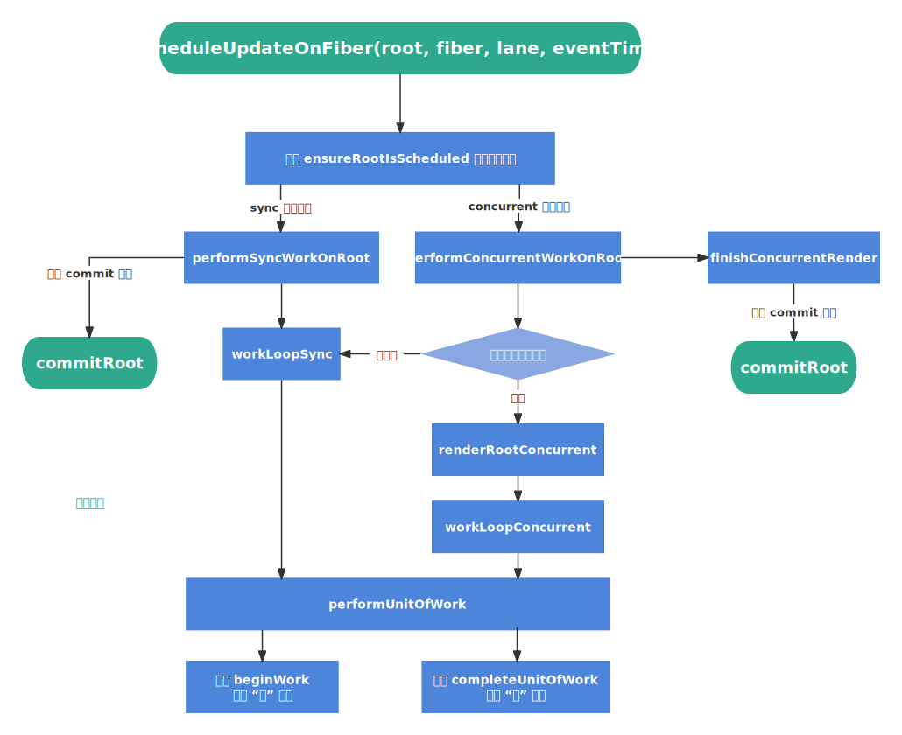

`scheduleUpdateOnFiber` [​](#scheduleupdateonfiber)
===================================================

在 `updateContainer` 中，我们创建了一个 `update` 对象，然后将其添加到更新队列中，接下来就是调用 `scheduleUpdateOnFiber` 进行更新（这也是 `render` 阶段的入口）

> `scheduleUpdateOnFiber` 流程图



> 源码地址 [scheduleUpdateOnFiber | react-reconciler/src/ReactFiberWorkLoop.old.js](https://github.com/wild2life/code-analysis/blob/f0dc66687fe470217252ef38ae4f0697dc2fc15d/react-v18.2.0/src/react/packages/react-reconciler/src/ReactFiberWorkLoop.old.js#L528)

```ts

    export function scheduleUpdateOnFiber(
      root: FiberRoot,
      fiber: Fiber,
      lane: Lane,
      eventTime: number
    ) {
      checkForNestedUpdates()
    
      markRootUpdated(root, lane, eventTime)
    
      // executionContext & RenderContext 的值为 0，workInProgressRoot 为 null
      if ((executionContext & RenderContext) !== NoLanes && root === workInProgressRoot) {
        workInProgressRootRenderPhaseUpdatedLanes = mergeLanes(
          workInProgressRootRenderPhaseUpdatedLanes,
          lane
        )
      } else {
        // ... 省略部分无关代码
    
        // 注册调度任务
        ensureRootIsScheduled(root, eventTime)
    
        // ... 省略部分无关代码
      }
    }

```

`ensureRootIsScheduled` [​](#ensurerootisscheduled)
---------------------------------------------------

`ensureRootIsScheduled` 函数用于注册调度任务，其大致流程如下：

*   判断是否需要注册新的调度（如果无需新的调度，会退出函数）
*   注册调度任务
    *   将 `performSyncWorkOnRoot` 或 `performConcurrentWorkOnRoot` 添加到调度队列（`scheduleCallback`）中
    *   等待调度中心执行 `performSyncWorkOnRoot` 或 `performConcurrentWorkOnRoot`

::: tip 
`performSyncWorkOnRoot` 和 `performConcurrentWorkOnRoot`

*   在 `sync` 同步模式下会执行 `performSyncWorkOnRoot`
*   在 `concurrent` 并发模式下会执行 `performConcurrentWorkOnRoot`

这两个函数的作用是执行 `render` 阶段和 `commit` 阶段

::: 
> 源码地址 [ensureRootIsScheduled | react-reconciler/src/ReactFiberWorkLoop.old.js](https://github.com/wild2life/code-analysis/blob/f0dc66687fe470217252ef38ae4f0697dc2fc15d/react-v18.2.0/src/react/packages/react-reconciler/src/ReactFiberWorkLoop.old.js#L691)

```ts

    function ensureRootIsScheduled(root: FiberRoot, currentTime: number) {
      /* 这一部分用于判断是否需要注册新的调度 */
    
      const existingCallbackNode = root.callbackNode
    
      // 对被其他高优先级工作“饿死”的 lane 进行标记，以便在下次调度时优先处理这些 lane
      markStarvedLanesAsExpired(root, currentTime)
    
      // 获取下一个
      const nextLanes = getNextLanes(
        root,
        root === workInProgressRoot ? workInProgressRootRenderLanes : NoLanes
      )
    
      // 如果没有需要调度的任务，则取消当前正在调度的任务
      if (nextLanes === NoLanes) {
        if (existingCallbackNode !== null) {
          cancelCallback(existingCallbackNode)
        }
        root.callbackNode = null
        root.callbackPriority = NoLane
        return
      }
    
      // 获取新的调度任务的优先级
      const newCallbackPriority = getHighestPriorityLane(nextLanes)
    
      // 当前正在调度任务的优先级
      const existingCallbackPriority = root.callbackPriority
      if (
        existingCallbackPriority === newCallbackPriority &&
        !(
          __DEV__ &&
          ReactCurrentActQueue.current !== null &&
          existingCallbackNode !== fakeActCallbackNode
        )
      ) {
        return
      }
    
      if (existingCallbackNode != null) {
        cancelCallback(existingCallbackNode)
      }
    
      /* 这一部分是注册新的调度任务 */
      let newCallbackNode
      // 如果是同步任务
      if (newCallbackPriority === SyncLane) {
        // 如果是 legacy 模式
        if (root.tag === LegacyRoot) {
          if (__DEV__ && ReactCurrentActQueue.isBatchingLegacy !== null) {
            ReactCurrentActQueue.didScheduleLegacyUpdate = true
          }
          // 内部执行的还是 scheduleSyncCallback
          scheduleLegacySyncCallback(performSyncWorkOnRoot.bind(null, root))
        } else {
          scheduleSyncCallback(performSyncWorkOnRoot.bind(null, root))
        }
        if (supportsMicrotasks) {
          if (__DEV__ && ReactCurrentActQueue.current !== null) {
            ReactCurrentActQueue.current.push(flushSyncCallbacks)
          } else {
            // 如果支持微任务，就使用 scheduleMicrotask
            scheduleMicrotask(() => {
              if ((executionContext & (RenderContext | CommitContext)) === NoContext) {
                flushSyncCallbacks()
              }
            })
          }
        } else {
          // 不支持微任务的话，就使用 scheduleCallback
          scheduleCallback(ImmediateSchedulerPriority, flushSyncCallbacks)
        }
        newCallbackNode = null
      } else {
        let schedulerPriorityLevel
        // 根据 Lane 优先级来设置调度优先级
        switch (lanesToEventPriority(nextLanes)) {
          case DiscreteEventPriority:
            schedulerPriorityLevel = ImmediateSchedulerPriority
            break
          case ContinuousEventPriority:
            schedulerPriorityLevel = UserBlockingSchedulerPriority
            break
          case DefaultEventPriority:
            schedulerPriorityLevel = NormalSchedulerPriority
            break
          case IdleEventPriority:
            schedulerPriorityLevel = IdleSchedulerPriority
            break
          default:
            schedulerPriorityLevel = NormalSchedulerPriority
            break
        }
        // 将 performConcurrentWorkOnRoot 添加到调度队列中
        newCallbackNode = scheduleCallback(
          schedulerPriorityLevel,
          performConcurrentWorkOnRoot.bind(null, root)
        )
      }
    
      // 更新 root 的 callbackPriority 和 callbackNode
      root.callbackPriority = newCallbackPriority
      root.callbackNode = newCallbackNode
    }

``` 

`performSyncWorkOnRoot` [​](#performsyncworkonroot)
---------------------------------------------------

在 `sync` 同步模式下会执行 `performSyncWorkOnRoot`

> 源码地址 [performSyncWorkOnRoot | react-reconciler/src/ReactFiberWorkLoop.old.js](https://github.com/wild2life/code-analysis/blob/f0dc66687fe470217252ef38ae4f0697dc2fc15d/react-v18.2.0/src/react/packages/react-reconciler/src/ReactFiberWorkLoop.old.js#L1224)

```ts

    function performSyncWorkOnRoot(root) {
      if (enableProfilerTimer && enableProfilerNestedUpdatePhase) {
        syncNestedUpdateFlag();
      }
    
      if ((executionContext & (RenderContext | CommitContext)) !== NoContext) {
        throw new Error('Should not already be working.');
      }
      // 处理 passive effect（即触发 useEffect 的创建、销毁函数及其他同步任务）
      flushPassiveEffects();
    
      let lanes = getNextLanes(root, NoLanes);
      // 如果没有需要处理的任务，直接返回
      if (!includesSomeLane(lanes, SyncLane)) {
        ensureRootIsScheduled(root, now());
        return null;
      }
    
      // 构建 fiber 树
      let exitStatus = renderRootSync(root, lanes);
      // 异常处理
      if (root.tag !== LegacyRoot && exitStatus === RootErrored) {
        const errorRetryLanes = getLanesToRetrySynchronouslyOnError(root);
        if (errorRetryLanes !== NoLanes) {
          lanes = errorRetryLanes;
          exitStatus = recoverFromConcurrentError(root, errorRetryLanes);
        }
      }
    
      // 如果是 fatal 错误，直接抛出
      if (exitStatus === RootFatalErrored) {
        const fatalError = workInProgressRootFatalError;
        prepareFreshStack(root, NoLanes);
        markRootSuspended(root, lanes);
        ensureRootIsScheduled(root, now());
        throw fatalError;
      }
    
      if (exitStatus === RootDidNotComplete) {
        throw new Error('Root did not complete. This is a bug in React.');
      }
    
      // 渲染 fiber 树
      const finishedWork: Fiber = (root.current.alternate: any);
      root.finishedWork = finishedWork;
      root.finishedLanes = lanes;
      // 进入 commit 阶段
      commitRoot(
        root,
        workInProgressRootRecoverableErrors,
        workInProgressTransitions,
      );
    
      // 退出前再次检测是否有其他更新
      ensureRootIsScheduled(root, now());
    
      return null;
    }

```

`performConcurrentWorkOnRoot` [​](#performconcurrentworkonroot)
---------------------------------------------------------------

在 `concurrent` 并发模式下会执行 `performConcurrentWorkOnRoot`

> 源码地址 [performConcurrentWorkOnRoot | react-reconciler/src/ReactFiberWorkLoop.old.js](https://github.com/wild2life/code-analysis/blob/f0dc66687fe470217252ef38ae4f0697dc2fc15d/react-v18.2.0/src/react/packages/react-reconciler/src/ReactFiberWorkLoop.old.js#L824)

```ts

    function performConcurrentWorkOnRoot(root, didTimeout) {
      if (enableProfilerTimer && enableProfilerNestedUpdatePhase) {
        resetNestedUpdateFlag();
      }
    
      // 当前在 React 事件中可以清除当前事件时间，下一次更新将计算新的事件时间
      currentEventTime = NoTimestamp;
      currentEventTransitionLane = NoLanes;
    
      if ((executionContext & (RenderContext | CommitContext)) !== NoContext) {
        throw new Error('Should not already be working.');
      }
    
      const originalCallbackNode = root.callbackNode;
      // 处理 passive effect（即触发 useEffect 的创建、销毁函数及其他同步任务）
      const didFlushPassiveEffects = flushPassiveEffects();
      if (didFlushPassiveEffects) {
        if (root.callbackNode !== originalCallbackNode) {
          return null;
        } else {
          // Current task was not canceled. Continue.
        }
      }
    
      // 获取下一个要处理的 lanes
      let lanes = getNextLanes(
        root,
        root === workInProgressRoot ? workInProgressRootRenderLanes : NoLanes,
      );
      // 永远不会执行
      if (lanes === NoLanes) {
        // Defensive coding. This is never expected to happen.
        return null;
      }
    
      // 是否开启时间分片
      const shouldTimeSlice =
        !includesBlockingLane(root, lanes) &&
        !includesExpiredLane(root, lanes) &&
        (disableSchedulerTimeoutInWorkLoop || !didTimeout);
    
      // 构建 fiber 树
      let exitStatus = shouldTimeSlice
        ? renderRootConcurrent(root, lanes)
        : renderRootSync(root, lanes);
    
      // 检查退出状态
      if (exitStatus !== RootInProgress) {
        // 是否出现错误
        if (exitStatus === RootErrored) {
          const errorRetryLanes = getLanesToRetrySynchronouslyOnError(root);
          if (errorRetryLanes !== NoLanes) {
            lanes = errorRetryLanes;
            exitStatus = recoverFromConcurrentError(root, errorRetryLanes);
          }
        }
        // 是否出现 fatal 错误
        if (exitStatus === RootFatalErrored) {
          const fatalError = workInProgressRootFatalError;
          prepareFreshStack(root, NoLanes);
          markRootSuspended(root, lanes);
          ensureRootIsScheduled(root, now());
          throw fatalError;
        }
        // 是否未完成
        if (exitStatus === RootDidNotComplete) {
          // The render unwound without completing the tree. This happens in special
          // cases where need to exit the current render without producing a
          // consistent tree or committing.
          //
          // This should only happen during a concurrent render, not a discrete or
          // synchronous update. We should have already checked for this when we
          // unwound the stack.
          markRootSuspended(root, lanes);
        } else {
          // 渲染完成
    
          const renderWasConcurrent = !includesBlockingLane(root, lanes);
          const finishedWork: Fiber = (root.current.alternate: any);
          if (
            renderWasConcurrent &&
            !isRenderConsistentWithExternalStores(finishedWork) // 判断 store 是否一致
          ) {
            // A store was mutated in an interleaved event. Render again,
            // synchronously, to block further mutations.
            exitStatus = renderRootSync(root, lanes);
    
            // 再次检查是否出现错误
            if (exitStatus === RootErrored) {
              const errorRetryLanes = getLanesToRetrySynchronouslyOnError(root);
              if (errorRetryLanes !== NoLanes) {
                lanes = errorRetryLanes;
                exitStatus = recoverFromConcurrentError(root, errorRetryLanes);
              }
            }
            // 再次检查是否出现 fatal 错误
            if (exitStatus === RootFatalErrored) {
              const fatalError = workInProgressRootFatalError;
              prepareFreshStack(root, NoLanes);
              markRootSuspended(root, lanes);
              ensureRootIsScheduled(root, now());
              throw fatalError;
            }
          }
    
          // We now have a consistent tree. The next step is either to commit it,
          // or, if something suspended, wait to commit it after a timeout.
          root.finishedWork = finishedWork;
          root.finishedLanes = lanes;
    
          // 完成并发渲染的后续处理（即进入 commit 阶段）
          finishConcurrentRender(root, exitStatus, lanes);
        }
      }
    
      // 退出前再次检测是否有其他更新
      ensureRootIsScheduled(root, now());
      // 判断是否和缓存值一致
      if (root.callbackNode === originalCallbackNode) {
        // 渲染被打断，返回一个新的 performConcurrentWorkOnRoot 等待下一次调度
        return performConcurrentWorkOnRoot.bind(null, root);
      }
      return null;
    }

```

`renderRootSync` [​](#renderrootsync)
-------------------------------------

> 源码地址 [renderRootSync | react-reconciler/src/ReactFiberWorkLoop.old.js](https://github.com/wild2life/code-analysis/blob/f0dc66687fe470217252ef38ae4f0697dc2fc15d/react-v18.2.0/src/react/packages/react-reconciler/src/ReactFiberWorkLoop.old.js#L1658)

```ts

    function renderRootSync(root: FiberRoot, lanes: Lanes) {
      // 保存当前执行上下文
      const prevExecutionContext = executionContext
      // 设置当前执行上下文为 render 上下文
      executionContext |= RenderContext
      const prevDispatcher = pushDispatcher()
    
      // 判断是否需要创建新的 workInProgressRoot 树
      if (workInProgressRoot !== root || workInProgressRootRenderLanes !== lanes) {
        if (enableUpdaterTracking) {
          if (isDevToolsPresent) {
            const memoizedUpdaters = root.memoizedUpdaters
            if (memoizedUpdaters.size > 0) {
              restorePendingUpdaters(root, workInProgressRootRenderLanes)
              memoizedUpdaters.clear()
            }
    
            // At this point, move Fibers that scheduled the upcoming work from the Map to the Set.
            // If we bailout on this work, we'll move them back (like above).
            // It's important to move them now in case the work spawns more work at the same priority with different updaters.
            // That way we can keep the current update and future updates separate.
            movePendingFibersToMemoized(root, lanes)
          }
        }
    
        workInProgressTransitions = getTransitionsForLanes(root, lanes)
    
        // 创建 workInProgressRoot 树
        prepareFreshStack(root, lanes)
      }
    
      if (enableSchedulingProfiler) {
        markRenderStarted(lanes)
      }
    
      /**
       * 循环条件为 true
       * 只有正常执行完 workLoopSync 才会 break
       * 如果 workLoopSync 抛出异常，会被 handleError 捕获，然后继续循环，直到正常执行完毕
       */
      do {
        try {
          workLoopSync()
          break
        } catch (thrownValue) {
          handleError(root, thrownValue)
        }
      } while (true)
    
      resetContextDependencies()
    
      // 将执行上下文修改为之前的上下文
      executionContext = prevExecutionContext
      popDispatcher(prevDispatcher)
    
      if (workInProgress !== null) {
        throw new Error(
          'Cannot commit an incomplete root. This error is likely caused by a ' +
            'bug in React. Please file an issue.'
        )
      }
    
      if (enableSchedulingProfiler) {
        markRenderStopped()
      }
    
      // 设置 workInProgressRoot 为 null，表示没有正在进行的渲染
      workInProgressRoot = null
      workInProgressRootRenderLanes = NoLanes
    
      return workInProgressRootExitStatus
    }

```

`renderRootConcurrent` [​](#renderrootconcurrent)
-------------------------------------------------

`renderRootConcurrent` 和 `renderRootSync` 大体逻辑一致

> 源码地址 [renderRootConcurrent | react-reconciler/src/ReactFiberWorkLoop.old.js](https://github.com/wild2life/code-analysis/blob/f0dc66687fe470217252ef38ae4f0697dc2fc15d/react-v18.2.0/src/react/packages/react-reconciler/src/ReactFiberWorkLoop.old.js#L1743)

```ts

    function renderRootConcurrent(root: FiberRoot, lanes: Lanes) {
      const prevExecutionContext = executionContext
      executionContext |= RenderContext
      const prevDispatcher = pushDispatcher()
    
      // 判断是否需要创建新的 workInProgressRoot 树
      if (workInProgressRoot !== root || workInProgressRootRenderLanes !== lanes) {
        if (enableUpdaterTracking) {
          if (isDevToolsPresent) {
            const memoizedUpdaters = root.memoizedUpdaters
            if (memoizedUpdaters.size > 0) {
              restorePendingUpdaters(root, workInProgressRootRenderLanes)
              memoizedUpdaters.clear()
            }
    
            // At this point, move Fibers that scheduled the upcoming work from the Map to the Set.
            // If we bailout on this work, we'll move them back (like above).
            // It's important to move them now in case the work spawns more work at the same priority with different updaters.
            // That way we can keep the current update and future updates separate.
            movePendingFibersToMemoized(root, lanes)
          }
        }
    
        workInProgressTransitions = getTransitionsForLanes(root, lanes)
        resetRenderTimer()
        prepareFreshStack(root, lanes)
      }
    
      if (enableSchedulingProfiler) {
        markRenderStarted(lanes)
      }
    
      /**
       * 循环条件为 true
       * 只有正常执行完 workLoopConcurrent 才会 break
       * 如果 workLoopConcurrent 抛出异常，会被 handleError 捕获，然后继续循环，直到正常执行完毕
       */
      do {
        try {
          workLoopConcurrent()
          break
        } catch (thrownValue) {
          handleError(root, thrownValue)
        }
      } while (true)
    
      resetContextDependencies()
    
      popDispatcher(prevDispatcher)
      executionContext = prevExecutionContext
    
      // Check if the tree has completed.
      if (workInProgress !== null) {
        // Still work remaining.
        if (enableSchedulingProfiler) {
          markRenderYielded()
        }
        return RootInProgress
      } else {
        // Completed the tree.
        if (enableSchedulingProfiler) {
          markRenderStopped()
        }
    
        // Set this to null to indicate there's no in-progress render.
        workInProgressRoot = null
        workInProgressRootRenderLanes = NoLanes
    
        // Return the final exit status.
        return workInProgressRootExitStatus
      }
    }

```

`workLoopSync` [​](#workloopsync)
---------------------------------

`workLoopSync` 函数会一直执行 `performUnitOfWork` 函数，直到 `workInProgress === null`，表示没有正在进行的渲染

> 源码地址 [workLoopSync | react-reconciler/src/ReactFiberWorkLoop.old.js](https://github.com/wild2life/code-analysis/blob/f0dc66687fe470217252ef38ae4f0697dc2fc15d/react-v18.2.0/src/react/packages/react-reconciler/src/ReactFiberWorkLoop.old.js#L1738)

```ts

    function workLoopSync() {
      while (workInProgress !== null) {
        performUnitOfWork(workInProgress)
      }
    }
```

`workLoopConcurrent` [​](#workloopconcurrent)
---------------------------------------------

`workLoopConcurrent` 函数在 `workLoopSync` 的基础上增加了 `shouldYield` 的判断

`shouldYield` 函数会判断当前是否有剩余时间，如果没有剩余时间，就会返回 `true` 表示需要中断当前任务

> 源码地址 [workLoopConcurrent | react-reconciler/src/ReactFiberWorkLoop.old.js](https://github.com/wild2life/code-analysis/blob/f0dc66687fe470217252ef38ae4f0697dc2fc15d/react-v18.2.0/src/react/packages/react-reconciler/src/ReactFiberWorkLoop.old.js#L1824)

```ts

    function workLoopConcurrent() {
      // Perform work until Scheduler asks us to yield
      while (workInProgress !== null && !shouldYield()) {
        performUnitOfWork(workInProgress)
      }
    }

```

`performUnitOfWork` [​](#performunitofwork)
-------------------------------------------

`performUnitOfWork` 函数会做以下几件事情

*   调用 `beginWork` 函数，进入 **“递” 阶段**
    *   根据传入的 `Fiber 节点` 创建 `子 Fiber 节点`
*   调用 `completeUnitOfWork` 函数，进入 **“归” 阶段**
    *   调用 `completeWork` 函数对创建好的 `Fiber 节点` 进行处理
*   更新 `workInProgress` 指针，指向下一个 `Fiber 节点`

> 源码地址 [performUnitOfWork | react-reconciler/src/ReactFiberWorkLoop.old.js](https://github.com/wild2life/code-analysis/blob/f0dc66687fe470217252ef38ae4f0697dc2fc15d/react-v18.2.0/src/react/packages/react-reconciler/src/ReactFiberWorkLoop.old.js#L1831)

```ts

    function performUnitOfWork(unitOfWork: Fiber): void {
      // unitOfWork 即传入的 workInProgress
      const current = unitOfWork.alternate
    
      let next
      // 调用 beginWork 函数，进入 “递” 阶段
      if (enableProfilerTimer && (unitOfWork.mode & ProfileMode) !== NoMode) {
        startProfilerTimer(unitOfWork)
        next = beginWork(current, unitOfWork, subtreeRenderLanes)
        stopProfilerTimerIfRunningAndRecordDelta(unitOfWork, true)
      } else {
        next = beginWork(current, unitOfWork, subtreeRenderLanes)
      }
    
      // 收集 props
      unitOfWork.memoizedProps = unitOfWork.pendingProps
    
      // 当 next 为 null 时，表示当前 workInProgress 没有子节点
      if (next === null) {
        // 调用 completeUnitOfWork 函数，进入 “归” 阶段
        completeUnitOfWork(unitOfWork)
      } else {
        // 更新 workInProgress 指针为 next （即子 Fiber 节点）
        workInProgress = next
      }
    
      ReactCurrentOwner.current = null
    }

```

::: tip 

整个 `Fiber 树` 的构建是一个深度优先遍历，其中的两个重要变量 `workInProgress` 和 `current` 即之前说的 [Fiber 双缓存机制](../base/fiber#fiber-双缓存的构建)

*   `workInProgress` 和 `current` 都是一个指针
*   `workInProgress` 表示当前正在构建的 `Fiber 节点`
*   `current = workInProgress.alternate` （即 `fiber.alternate`）表示当前页面正在使用的 `Fiber 节点`
    *   初次构建时页面还未渲染，此时 `current = null`

在深度优先遍历中每个 `Fiber 节点` 都会经历两个阶段

*   **“递”阶段** `beginWork`
*   **“归”阶段** `completeWork`

这两个阶段共同完成了每一个 `Fiber 节点` 的创建, 所有 `Fiber 节点` 连接起来就是一棵 `Fiber 树`

::: 
### `performUnitOfWork` 流程概览 [​](#performunitofwork-流程概览)

> 以下面的代码举 🌰

```js

    function App() {
      return (
        <div>
          i am
          <span>KaSong</span>
        </div>
      )
    }

```

对应的 `Fiber 树结构` 如下


`performUnitOfWork` 函数的执行步骤

```md

    rootFiber     beginWork
    App Fiber     beginWork
    div Fiber     beginWork
    "i am" Fiber  beginWork
    "i am" Fiber    completeWork
    span Fiber    beginWork
    span Fiber      completeWork
    div Fiber       completeWork
    App Fiber       completeWork
    rootFiber       completeWork

```

* * *

相关资料

*   [render 阶段流程概览 | React 技术揭秘](https://react.iamkasong.com/process/reconciler.html)
*   [fiber 树构造(初次创建) | 图解 React](https://7km.top/main/fibertree-create/)

