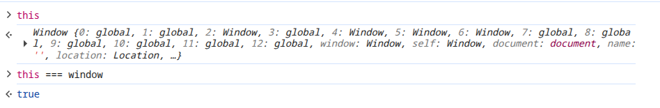
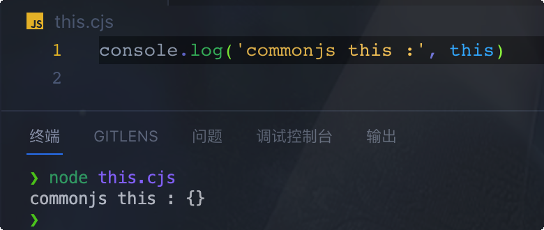
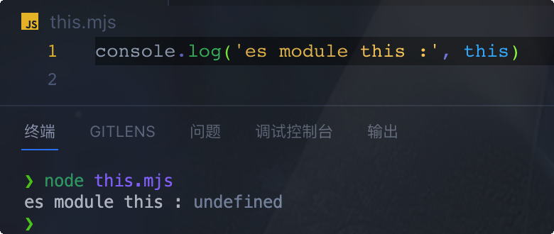
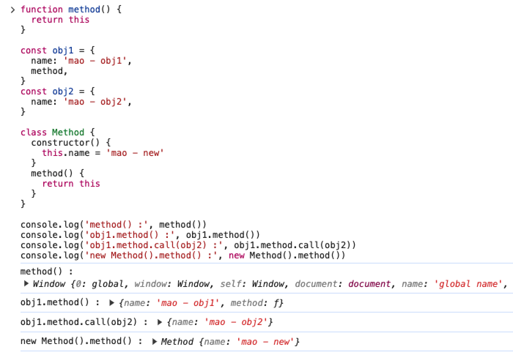

# this 指向

在 `JavaScript` 中，`this` 指向可以分为以下两种情况：

- 默认的全局 `this` 指向
- 函数调用时的 `this` 指向

## 默认的全局 this

默认的全局 `this` 指向取决于当前运行环境

### 浏览器环境
在浏览器环境中默认的全局 `this` 指向全局对象 `window`



### Node.js 环境

在 Node.js 环境中默认的全局 `this` 指向取决于当前使用的模块化规范

在 `CommonJS` 中默认的全局 `this` 指向一个空对象
```
this // {}
```



在 `ESModule` 中默认的全局 `this` 指向 `undefined`
```
this // undefined
```



## 函数调用时的 this
函数调用时的 `this` 指向取决于函数的调用方式，一共有如下几种情况

| 调用方式                 | 示例                 | 函数中的 this 指向                                   |
|--------------------------|--------------------|----------------------------------------------------|
| 直接调用                 | `method()`          | 全局对象<br>浏览器环境为 `window` 对象<br>Node.js 环境为 `global` 对象 |
| 通过对象方法调用           | `obj.method()`      | 前面的对象                                           |
| 通过 `call`、`apply`、`bind` 调用 | `method.call({})`   | 第一个参数                                           |
| 通过 `new` 构造函数调用    | `new method()`      | 新创建的对象                                         |
| 箭头函数                 | `() => {}`          | 箭头函数中的 `this` 指向外层作用域的第一个 `this`    |


```js
function method() {
  return this
}

const obj1 = {
  name: 'mao - obj1',
  method,
}
const obj2 = {
  name: 'mao - obj2',
}

class Method {
  constructor() {
    this.name = 'mao - new'
  }
  method() {
    return this
  }
}

// 全局对象
console.log('method() :', method())
// 方法名前面的对象
console.log('obj1.method() :', obj1.method())
// call 的第一个参数
console.log('obj1.method.call(obj2) :', obj1.method.call(obj2))
// new 创建的对象
console.log('new Method().method() :', new Method().method())
```

### 在浏览器环境中 
this 指向 window 对象


### 在 Node.js 环境 
`CommonJS` 中 `this` 指向 `global` 对象

`ESModule` 中 `this` 指向 `undefined`

