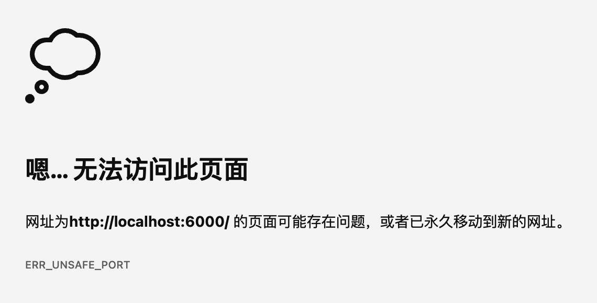

# 浏览器踩坑记录

记录个人遇到或他人分享的浏览器相关踩坑记录

## 部分端口号无法访问

在启动本地开发环境时，发现部分端口号可以启动项目但浏览器无法访问（并提示 `ERR_UNSAFE_PORT`），例如 `6000` 端口，但 `6001` 端口可以正常访问



原因：浏览器有非安全端口限制

> 以下是非安全端口列表

```c

    const int kRestrictedPorts[] = {
      1,      // tcpmux
      7,      // echo
      9,      // discard
      11,     // systat
      13,     // daytime
      15,     // netstat
      17,     // qotd
      19,     // chargen
      20,     // ftp data
      21,     // ftp access
      22,     // ssh
      23,     // telnet
      25,     // smtp
      37,     // time
      42,     // name
      43,     // nicname
      53,     // domain
      69,     // tftp
      77,     // priv-rjs
      79,     // finger
      87,     // ttylink
      95,     // supdup
      101,    // hostriame
      102,    // iso-tsap
      103,    // gppitnp
      104,    // acr-nema
      109,    // pop2
      110,    // pop3
      111,    // sunrpc
      113,    // auth
      115,    // sftp
      117,    // uucp-path
      119,    // nntp
      123,    // NTP
      135,    // loc-srv /epmap
      137,    // netbios
      139,    // netbios
      143,    // imap2
      161,    // snmp
      179,    // BGP
      389,    // ldap
      427,    // SLP (Also used by Apple Filing Protocol)
      465,    // smtp+ssl
      512,    // print / exec
      513,    // login
      514,    // shell
      515,    // printer
      526,    // tempo
      530,    // courier
      531,    // chat
      532,    // netnews
      540,    // uucp
      548,    // AFP (Apple Filing Protocol)
      554,    // rtsp
      556,    // remotefs
      563,    // nntp+ssl
      587,    // smtp (rfc6409)
      601,    // syslog-conn (rfc3195)
      636,    // ldap+ssl
      989,    // ftps-data
      990,    // ftps
      993,    // ldap+ssl
      995,    // pop3+ssl
      1719,   // h323gatestat
      1720,   // h323hostcall
      1723,   // pptp
      2049,   // nfs
      3659,   // apple-sasl / PasswordServer
      4045,   // lockd
      5060,   // sip
      5061,   // sips
      6000,   // X11
      6566,   // sane-port
      6665,   // Alternate IRC [Apple addition]
      6666,   // Alternate IRC [Apple addition]
      6667,   // Standard IRC [Apple addition]
      6668,   // Alternate IRC [Apple addition]
      6669,   // Alternate IRC [Apple addition]
      6697,   // IRC + TLS
      10080,  // Amanda
    };
``` 

[kRestrictedPorts | Chromium](https://chromium.googlesource.com/chromium/src.git/+/master/net/base/port_util.cc#22)

**解决方法**：

1.  修改项目启动端口为其他可访问的端口（推荐）
2.  修改浏览器启动参数放开端口限制
    1.  MacOS 系统：通过终端命令 `open -a "Google Chrome" --args --explicitly-allowed-ports=6000,6666` 启动浏览器
    2.  Windows 系统：在桌面快捷方式上右键，选择 `属性`，在 `目标` 后面添加 `--explicitly-allowed-ports=6000,6666` 后保存，再通过快捷方式启动浏览器

